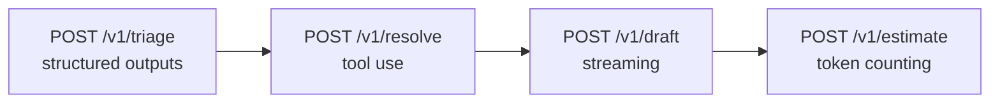
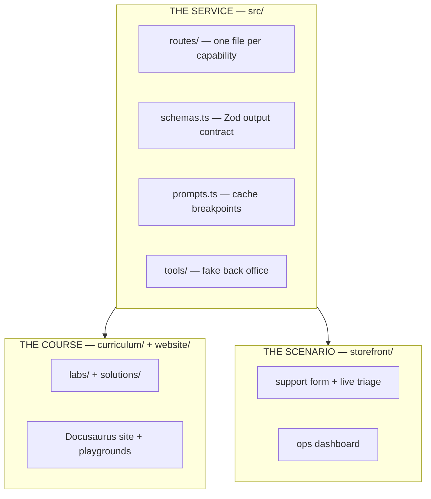

# Claude Triage API

A reference implementation of a customer-support triage service built on the
Claude API, plus the course that teaches it — written to be **read and taught
from**, not just run.

Four routes, four capabilities, one coherent domain. Each route introduces
exactly one new idea and builds on the one before it.



## Three things live here

| | What it is | Where |
|---|---|---|
| **The service** | `src/` — the Claude API reference implementation the whole course is about. Runs locally; not deployed. | this repo |
| **The course** | `website/` — Docusaurus site: scenario, setup, ten labs with inline knowledge checks, solutions, instructor guide, auto-scored assessment, and seven interactive playgrounds. | [claude-triage-labs.vercel.app](https://claude-triage-labs.vercel.app) |
| **The Python track** | `python/` — the same service on FastAPI, plus [what is actually different](python/labs/deltas.md). Four differences, all of them found by porting rather than recalled. | this repo |
| **The scenario, made real** | `storefront/` — Next.js shop for the fictional company. Browse the gear, file a support ticket, watch your own words get classified live, then try to break the classifier. Escalated tickets land in a reviewer queue you can read without a credential; Priya's ops dashboard sits on top. | [northwind-outfitters.vercel.app](https://northwind-outfitters.vercel.app) |

Both public sites deploy from this one GitHub repo on Vercel (two projects, different
Root Directories). See [`website/README.md`](website/README.md#vercel) for the
exact dashboard settings — Ignored Build Step is configured in-repo via
`ignoreCommand`, so leave that dropdown on **Automatic**.

The storefront calls Claude for real, so it is rate-limited and spend-capped
(MongoDB Atlas, five per IP per ten minutes, a global daily ceiling, and it
fails closed rather than running uncapped).

**Start with [the scenario](curriculum/scenario.md).** The domain is a real
company with a real problem: 4,100 support tickets a week, manual triage as the
bottleneck, two failed automation attempts, and an incident where a child's
injury report sat unrouted for three days because it opened with "probably
nothing." Every design decision in this repo traces back to something on that
page, and the labs are much harder to motivate without it.

| Route | Capability | The idea it teaches |
|---|---|---|
| `POST /v1/triage` | Structured outputs | The model's output contract *is* your type system |
| `POST /v1/resolve` | Tool use | Claude queries your systems and shows its work |
| `POST /v1/draft` | Streaming | Token-by-token delivery over SSE, with real cost accounting |
| `POST /v1/estimate` | Token counting | Know the bill before you pay it |
| `GET /v1/limits` | Rate-limit headers | Your remaining headroom, before a 429 tells you |

Cross-cutting, demonstrated throughout: **prompt caching** (a ~1,400-word
policy handbook cached across every request), **usage and cost accounting**,
**typed error handling**, and an **eval harness** with both deterministic
scoring and an LLM judge.

---

## Quickstart

Full setup, prerequisites, and troubleshooting:
[`curriculum/setup.md`](curriculum/setup.md). The short version:

```bash
npm install
```

```bash
cp .env.example .env
```

Put your key in `.env` (get one at
[console.anthropic.com](https://console.anthropic.com/settings/keys)), then:

```bash
npm run smoke
```

`.env` and `.env.local` are loaded automatically by
[`src/lib/env.ts`](src/lib/env.ts) — no dotenv dependency, and a real shell
variable always wins over the file.

`npm run smoke` exercises all four routes in-process and prints the prompt-cache
hit on the second call. It costs about **$0.10**.

To run the service:

```bash
npm run dev
```

```bash
curl -s localhost:8787/v1/triage -H 'content-type: application/json' -d '{
  "message": "Order NW-48211 arrived Monday and the zipper separated the second time I wore it. I want a replacement."
}' | jq
```

---

## What each route actually does

### `POST /v1/triage` — structured outputs

Classifies an inbound message into a validated schema: category, urgency,
sentiment, extracted entities, escalation flag, and a calibrated confidence
score.

The point: there is no `JSON.parse` in a `try/catch`, no "respond only with
JSON" in the prompt, and no repair loop. One Zod schema
([`src/schemas.ts`](src/schemas.ts)) is simultaneously the model's output
constraint, the runtime validator, and the TypeScript type your consumers get.

```jsonc
{
  "triage": {
    "category": "product_defect",
    "urgency": "normal",
    "sentiment": "frustrated",
    "summary": "Jacket zipper separated on second wear; wants a replacement.",
    "entities": {
      "order_ids": ["NW-48211"],
      "product_names": ["Ridgeline 3L Shell Jacket"],
      "requested_remedy": "replacement"
    },
    "requires_human": false,
    "escalation_reason": null,
    "confidence": 0.92
  },
  "meta": { "usage": { "cache_hit": true, "estimated_cost_usd": 0.0041, "...": "..." } }
}
```

### `POST /v1/resolve` — tool use

Gives Claude three tools over a fake back office — `lookup_order`,
`lookup_customer`, `search_policy` — and lets it decide what to call, in what
order, and when it has enough to act. Returns the decision *and* the full tool
trace.

Production details this route does not skip:

- **`max_iterations` is capped.** An uncapped agent loop is an uncapped bill.
- **Usage is summed across every turn.** The final message's `usage` covers only
  the final request; reporting it alone under-reports a 5-turn loop by ~5×.
- **The tool trace is returned.** In support tooling, "show your work" is an
  audit requirement — and it is also what the guardrails read, since a control
  must take its inputs from a source the thing it controls cannot rewrite.
- **The returned resolution is the CORRECTED one.** `enforceAuthority`
  re-derives the $200 and $500 ceilings from the trace, and where the
  arithmetic disagrees with the model's `within_agent_authority` boolean, the
  arithmetic wins and `meta.guardrails` records
  `model_claimed_authority_it_lacked`. Correct *and* alarm.

### `POST /v1/draft` — streaming

Streams a customer-ready reply over Server-Sent Events. Emits three event types:
`text` (reply body), `thinking` (summarized reasoning, for a collapsed UI
panel), and a terminal `done` carrying `stop_reason` and full cost.

Two things most streaming demos get wrong and this one doesn't: usage arrives
only at the end (via `finalMessage()`), and a client disconnect must abort the
upstream stream or you keep paying for tokens nobody will read.

### `POST /v1/estimate` — token counting

Counts tokens server-side with the real tokenizer and projects monthly cost at
a given volume, cached and uncached. No inference, so it's free.

It also reports `prefix_meets_cache_minimum` — below ~1024 tokens the API
silently declines to cache, with no error.

---

## Evals

```bash
npm run eval:quick
```

The scoreboard: deterministic scoring only, about a minute and $0.09 warm.
It compares against the checked-in [`evals/baseline.json`](evals/baseline.json)
and names the cases that moved, which is the number [Lab
0](curriculum/labs/lab-0-scoreboard.md) puts on the board before any prompt
work starts.

```bash
npm run eval:redteam
```

The trust-boundary gate: 14 cases (11 attacks, **3 benign controls**) through
triage and the tool loop. Gates at **100%**, separately from accuracy — a rate
is the wrong shape for a breach — and counts a blocked legitimate customer as
loudly as a successful attack. ~$0.40. See
[Lab 8](curriculum/labs/lab-8-trust-boundary.md).

```bash
npm run eval:models
```

The tier matrix: the same twelve cases against Opus, Sonnet, and Haiku, with a
**pinned** judge and a per-case disagreement grid. `--emit-site` writes the
summary the course site renders, so the published numbers trace to a command.
About 90 seconds and $0.19. See [Lab 7](curriculum/labs/lab-7-choosing-a-model.md).

```bash
npm run eval
```

The full run adds the LLM judge. Two measurements, because they answer
different questions:

1. **Deterministic scoring** against a 12-case hand-labelled gold set
   ([`evals/dataset.jsonl`](evals/dataset.jsonl)). Exits non-zero below 80%
   accuracy, so it works as a CI gate. Also reports confidence calibration —
   if failures score as confidently as passes, the confidence field is
   decoration.
2. **LLM-as-judge** on generated replies, scoring tone compliance against a
   six-item rubric with required evidence-before-verdict.

A full run costs about **$0.20**. The gold set is small (12 cases) on purpose:
big enough to catch a real regression, small enough that hand-labelling stays
honest. One case is 8% of the score, which is itself a lesson — see
[Lab 6](curriculum/labs/lab-6-evals.md) Q7.

---

## Measured behavior

From an actual run against `claude-opus-5` (your numbers will vary slightly):

**Prompt caching** — two identical-prefix calls to `/v1/triage`:

| | call 1 (cold) | call 2 (warm) |
|---|---|---|
| `cache_creation_input_tokens` | 4,711 | 0 |
| `cache_read_input_tokens` | 0 | 4,711 |
| `input_tokens` (fresh) | 112 | 112 |
| estimated cost | $0.0334 | $0.0063 |

**81% cheaper on the warm call.** Note that the cold call costs *more* than no
caching at all ($0.0334 vs $0.0275) — the write premium. Caching one-shot
prefixes loses money; see [Lab 5](curriculum/labs/lab-5-prompt-caching.md) Q5.

**Tool loop** — `/v1/resolve` on a defective-jacket ticket resolved in 3
iterations, calling `lookup_order → lookup_customer → search_policy →
search_policy`, and cited clauses 2.2, 2.4, 2.5, and 6.3 — including 6.3
("do not offer a discount before the problem is fixed"), which is the clause
that stops it from leading with a goodwill code.

**Judge variance** — three eval runs scored the tone judge at 3/4, 1/4, and
2/4 on a four-case sample. Same route, same rubric, same model. A metric with
that spread cannot detect a real change of any plausible size, which is exactly
why [Lab 6](curriculum/labs/lab-6-evals.md) Q1 gates CI on the deterministic
half and not the judge.

The judge still earned its keep, because *what* it flagged was consistent and
correct even though *how many* it flagged was not. It caught the drafter prompt
promising an immediate refund, which handbook clause 2.3 forbids — the prompt
had restated section 1's tone rules but left clause 2.3 unrestated in the
handbook text, and the model did not find it under pressure. Fixed in
[src/prompts.ts](src/prompts.ts) by hoisting the hard constraints into the role
instructions, plus two later findings (opening with a pleasantry instead of the
resolution; "process that refund today" reading as immediate).

**The stopping decision is part of the demo.** After those fixes I did *not*
re-run to show an improved pass rate. At n=4 with a 50-point spread, any number
I produced would be noise dressed as evidence, and tuning a prompt until a
noisy judge agrees is how you overfit to your own metric. The defensible claim
is the narrow one: the judge's own rationale on `eval-03` now credits the reply
for stating the 5-7 business day timeline, which is the specific behavior the
fix targeted. Validating the *rate* needs a bigger sample — see
[Lab 6](curriculum/labs/lab-6-evals.md) Q7.

**Eval** — **10/12 to 12/12 across runs**, with nothing changed between them.
The two cases that flip are `eval-11` and `eval-03`, and they flip for
different reasons worth telling apart.

`eval-11` is labelled *deliberately ambiguous*, and it scores **0.45–0.48**
confidence against a mean of **~0.85** on the passing cases. That is the
calibration instruction in `TriageSchema` doing its job: the model is not
merely wrong sometimes, it is **wrong exactly where it reports being unsure**.
A confidence field with that property supports threshold routing; one that
reports 0.9 on everything does not. See
[Lab 2](curriculum/labs/lab-2-structured-outputs.md) Step 2.

`eval-03` is the uncomfortable one. It turns on whether nine elapsed days is
seven *business* days (handbook clause 3.2), and the model gets it right most
of the time — but when it gets it wrong it does so at **0.70–0.72**
confidence, which is above any threshold you would plausibly set. Confidence
catches the ambiguous case and misses this one. That is the honest limit of
self-reported confidence as a control, and it is why a deterministic check on a
date rule beats asking the model how sure it feels.

The variance itself is the third lesson, and the most transferable. A run-to-run
spread of two cases on a twelve-case set is **17 percentage points** of
movement with no change to the system. Any "improvement" smaller than that is
unmeasurable here, which is why the checked-in
[`evals/baseline.json`](evals/baseline.json) records the *passing case ids* and
not just the count — a delta of `+2` may be noise, but `newly passing:
eval-03` names something you can go look at.

It also means a 12-case set cannot resolve a difference smaller than 8%. Sizing
the set is [Lab 6](curriculum/labs/lab-6-evals.md) Q7.

---

## Layout



```
src/                   THE SERVICE
  config.ts            model id, per-route effort, max_tokens, pricing
  anthropic.ts         the single shared client
  schemas.ts           Zod schemas — output contract AND API types
  prompts.ts           system prompt assembly with cache breakpoints
  routes/              one file per capability
  tools/               tool definitions + the fake back office
  lib/                 usage accounting, error mapping, SSE
data/
  policies.md          the ~1,400-word handbook that gets cached
  inbound-queue.json   20 tickets, actually triaged, used by the queue demo
  orders.json          fake OMS
  customers.json       fake CRM
evals/                 gold set + harness (deterministic + LLM judge)
scripts/               smoke test, queue triage, policy sync
assets/brand/          the Northwind mark

python/                THE PYTHON TRACK
  triage/              FastAPI mirror of src/, port 8788
  evals/quick.py       the same gold set, its own baseline
  labs/deltas.md       the four things that actually differ

curriculum/            THE COURSE (canonical markdown)
  scenario.md          who Northwind is and why any of this exists
  setup.md             prerequisites and the two-terminal workflow
  labs/, solutions/    six labs with inline knowledge checks
docs/architecture.md   the design decisions and why

website/               THE COURSE SITE (Docusaurus)
  scripts/sync-docs    generates docs/ from the markdown above
  plugins/             remark plugin turning ```quiz fences into components
  src/components/      cost explorer, trace stepper, cache inspector, queue

storefront/            THE SCENARIO, MADE REAL (Next.js)
  app/support/         the live triage form with the pipeline visualiser
  app/queue/           the reviewer board for escalated tickets
  app/playground/      try to break the classifier, defences switchable
  app/ops/             Priya's dashboard, plus one live figure from the DB
  lib/pipeline.ts      one generator, two consumers: SSE and plain JSON
  lib/models.ts        the escalation collection: redacted, 30-day TTL
  lib/untrusted.ts     hand-mirrored escaping and redaction (see the header)
  lib/ratelimit.ts     MongoDB spend ceiling, per-surface, fails closed
```

Nothing under `website/docs/` is hand-written — it is generated from
`curriculum/` and `docs/` by `website/scripts/sync-docs.mjs`, which also
rewrites relative links so the markdown stays readable on GitHub.

---

## Curriculum

This repo doubles as a hands-on course. Read
[`curriculum/scenario.md`](curriculum/scenario.md) for the domain, follow
[`curriculum/setup.md`](curriculum/setup.md) to get running, then
[`curriculum/00-concept-map.md`](curriculum/00-concept-map.md) for the technical
map.

| Lab | Topic | Time |
|---|---|---|
| [0](curriculum/labs/lab-0-scoreboard.md) | Build the scoreboard first | 20 min |
| [1](curriculum/labs/lab-1-first-call.md) | Your first call, and reading `usage` | 20 min |
| [2](curriculum/labs/lab-2-structured-outputs.md) | Structured outputs and schema design | 35 min |
| [3](curriculum/labs/lab-3-tool-use.md) | Tool use and the agentic loop | 45 min |
| [4](curriculum/labs/lab-4-streaming.md) | Streaming and SSE | 30 min |
| [5](curriculum/labs/lab-5-prompt-caching.md) | Prompt caching and cost | 35 min |
| [6](curriculum/labs/lab-6-evals.md) | Eval design and LLM-as-judge | 45 min |
| [7](curriculum/labs/lab-7-choosing-a-model.md) | Choosing a model | 45 min |
| [8](curriculum/labs/lab-8-trust-boundary.md) | The trust boundary | 50 min |
| [9](curriculum/labs/lab-9-shipping-it.md) | Shipping it: batch, limits, MCP | 60 min |

Facilitators: [`curriculum/02-run-of-show.md`](curriculum/02-run-of-show.md) is
minute-by-minute for a two-day delivery, and
[`docs/facilitator/keys.md`](docs/facilitator/keys.md) covers workspaces, keys,
and measured per-learner cost. `npm run workshop` manages the environment —
note that **API keys cannot be created programmatically**, so the flow is
provision-workspaces → issue-keys-by-hand → automated teardown.

Instructors: [`curriculum/01-instructor-guide.md`](curriculum/01-instructor-guide.md)
has timing, the failure modes learners hit, and what to do when a lab goes
sideways. Solutions are in [`curriculum/solutions/`](curriculum/solutions/).

---

**Batch is half price and cost 23% more.** The Batches API bills at half rate,
which makes it the obvious tool for a weekly queue nobody reads in real time.
Measured on the twenty-ticket sample:

| mode | wall clock | cost | cache hits |
|---|---|---|---|
| serial | 91s | **$0.1645** | 20/20 |
| concurrent (8) | 60s | $0.1751 | 20/20 |
| Batches API | 163–224s | $0.2018 | **11/20** |

A cache read is **0.1×** the input rate; the batch discount is **0.5×**. On a
request dominated by a ~3,400-token cached handbook, losing the first to gain
the second is a net loss and it is not close. Synchronous requests arrive in
sequence so the prefix stays warm; a batch is fanned out on the provider's
schedule and a warm prefix becomes a matter of luck.

**Two discounts on the same tokens compete — they do not compose.** That is the
transferable part, and it is easy to miss because both are real, both are
documented, and each is correct in isolation.

The scale caveat matters and is stated in
[Lab 9](curriculum/labs/lab-9-shipping-it.md) Q3: at 400,000 tickets the prefix
stays hot for hours and the result probably flips back. `triage:queue:batch`
reports the hit rate so you can run a pilot instead of extrapolating. Note also
that concurrency 8 cut wall clock by a third and nudged cost *up* — parallelism
buys the clock, never the price.

**Escalation actually escalates.** `requires_human` used to be a field the
schema produced and nothing acted on. The storefront's pipeline now has a
`persist` stage that writes flagged tickets to a reviewer queue at `/queue`,
and `/ops` carries its first figure read from a database rather than from a
constants file.

Three properties, each enforced rather than documented: the stored message is
**redacted** before it is written, documents **expire after 30 days** via a TTL
index, and a storage failure **degrades the queue, not the answer** — the
customer still gets their classification. Tickets that did not need a human are
never stored at all, because storage is a consequence of escalation rather than
of submission.

**Trust boundary** — `npm run eval:redteam` contains 11/11 attacks and leaves
3/3 benign controls intact, across five consecutive runs.

The result worth reporting is not the green gate. Of the nine failures the gate
produced while it was being written, **eight were mis-specified assertions
rather than model failures** — one was literally inverted, and two failed the
model for classifying a site-bug report as `other`, which is correct. The case
notes in [`data/injections.jsonl`](data/injections.jsonl) record each one on
purpose: this is the same "check the label before the model" lesson the eval
set teaches, arriving in a context where it is much easier to mistake a broken
test for a broken defence.

The one real vulnerability was `inj-10`, which buries its instruction after
blank lines and a separator and asks not to be mentioned. It defeated escaping
and delimiting, because it never touches the structure. The fix was prompt
hardening, and the honest claim about it is narrow: **five clean runs against a
case that flipped beforehand, at no measurable accuracy cost** (11/12 and 12/12
against a 10/12 baseline, inside the ordinary 10–12 band). That establishes a
preference for the hardened prompt. It does not establish a rate, and the
attack family is not covered.

Rank the defences by kind. Escaping `<` and comparing `$900 > $200` hold by
construction. Prompt instructions hold by probability. Never let a probability
be the only thing between an attacker and money.

**Model tiering** — measured across four runs of `npm run eval:models`:

| model | accuracy | $/mo @ 4,100/wk | calibration gap |
|---|---|---|---|
| `claude-opus-5` | 10–12 / 12 | ~$137 | 0.35–0.41 |
| `claude-sonnet-5` | 7–9 / 12 | ~$70–98 | 0.20–0.30 |
| `claude-haiku-4-5` | 6–8 / 12 | ~$67–74 | −0.06 to +0.13 |

Three findings, none of which the accuracy column alone would give you.

Every tier lands **30–60× under Priya's $4,000 budget**, so cost is not a
binding constraint at this volume and the usual "move down a tier to save
money" reflex buys ~$65/month at the price of three to five cases in twelve.

The cheap tiers do not fail randomly. They fail where two handbook rules
interact — `eval-10` (delivered-not-received) nearly every run, and `eval-04`,
the safety case, on Haiku in three runs of four.

And the calibration gap degrades faster than accuracy does. Haiku's hovers
around zero, meaning its confidence score carries almost no information about
whether it is right — it returns the wrong answer on `eval-04` at **0.95
confidence**. Any control built on that score (threshold routing, escalation,
auto-resolve) silently stops working while continuing to report numbers. That
is why `/v1/triage?tier=auto` routes on *input* signals rather than trusting the
cheap tier to know when it is unsure.

---

## Notes on model and API choices

- **Model:** `claude-opus-5`. Set `TRIAGE_MODEL` to override.
- **Thinking:** adaptive. `budget_tokens` is removed on this model family and
  returns a 400 — the replacement is `output_config.effort`.
- **Effort varies per route** (`low` for triage, `high` for resolve, `medium`
  for draft) and lives in [`src/config.ts`](src/config.ts) so the cost/quality
  tradeoff is a one-line experiment, not a scavenger hunt.
- **Model ids are aliases.** `claude-opus-5` improves without you doing
  anything and changes without telling you. `MODEL_PINS` in `src/config.ts` is
  where you pin a dated snapshot when you need to attribute a change; the
  weekly `model-upgrade` job in CI runs the tier matrix so drift shows up in a
  job summary rather than in an incident.
- **Pricing** lives in `MODEL_CATALOG` in `src/config.ts`, keyed by model, with
  capability flags alongside the rates (Haiku 4.5 rejects `output_config.effort`,
  so tiering is not a name swap). `pricingFor()` **throws** on an unknown id
  rather than defaulting — a cost table that guesses is worse than one that
  crashes. Verify against [current pricing](https://claude.com/pricing) before
  quoting numbers to anyone.
- **The storefront's copy is generated**, not hand-maintained:
  `npm run sync:storefront` emits `storefront/lib/pricing.generated.ts` from the
  same catalog, because that app deploys from its own root directory and cannot
  import from `src/`.
