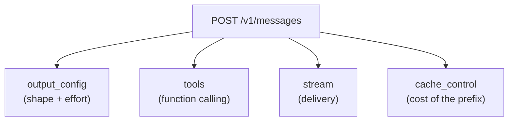
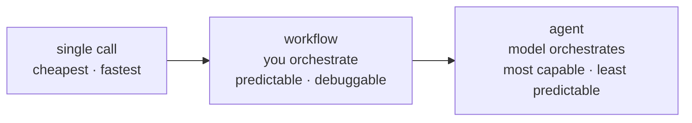
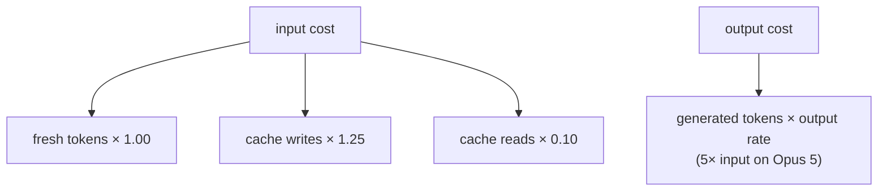

# Concept map — start here

One page. Read it before Lab 1, and come back to it when a lab result
surprises you.

This page is the *technical* map. For the domain — who Northwind Outfitters is,
why they need this, and what happens when it gets a message wrong — read
[the scenario](scenario.md) first. It is the shorter path to understanding why
the schema looks the way it does.

---

## Everything is one endpoint

Structured outputs, tool use, and streaming are **not three different APIs**.
They are three parameters on the same request. This is the single most
useful thing to internalize early: once you can make one Messages call, every
other capability is a field you add to it.

Supporting endpoints exist (`count_tokens`, `batches`, `files`, `models`) but
they feed into or describe this one.

---

## The four capabilities, and what each is actually for

| Capability | Parameter | Use it when | Don't use it when |
|---|---|---|---|
| **Structured outputs** | `output_config.format` | Another program consumes the result | A human reads the result as prose |
| **Tool use** | `tools` | The answer depends on data the model can't have | You already know what to fetch — just fetch it and put it in the prompt |
| **Streaming** | `.stream()` | A human is waiting and watching | A program is waiting; streaming adds complexity and no value |
| **Prompt caching** | `cache_control` | A large, stable prefix repeats across requests | Each request is unique |

The "don't use it when" column matters more than the left one. The most common
architectural mistake is reaching for tool use when a plain lookup plus a
single call would do — a tool call costs an extra round trip and an extra
inference, and buys you nothing when the retrieval logic is deterministic.

---

## Choosing your tier

Before you build an agent, check all four:

- **Complexity** — is the task multi-step and hard to specify up front?
- **Value** — does the outcome justify higher cost and latency?
- **Viability** — is Claude actually good at this task type?
- **Cost of error** — can mistakes be caught and recovered?

"No" to any of these means drop a tier.

In this repo: `/v1/triage` and `/v1/draft` are single calls. `/v1/resolve` is
an agent — and it earns it, because which lookups are needed depends on what
the earlier lookups returned.

### The other tier question: which model

Capability tiering is about how much *machinery* you build. Model tiering is
about which model that machinery calls, and the two are independent choices
that get confused constantly.

| | Input $/MTok | Output $/MTok | Notes |
|---|---|---|---|
| `claude-opus-5` | $5.00 | $25.00 | 1M context |
| `claude-sonnet-5` | $3.00 | $15.00 | 1M context |
| `claude-haiku-4-5` | $1.00 | $5.00 | 200K context; **rejects `output_config.effort`** |

Two things the price column does not tell you, both measured in
[Lab 7](labs/lab-7-choosing-a-model.md):

1. **Cheaper models are not uniformly worse — they are worse in a shape.** On
   this repo's gold set the cheap tiers hold their own on single-rule cases and
   lose the ones where two handbook rules interact. That is not 5% spread
   evenly; it is concentrated in the cases the system exists for.
2. **The confidence score degrades faster than the accuracy does.** Opus
   separates its wrong answers from its right ones by ~0.38 of confidence.
   Haiku separates them by roughly zero — so any control you build on top of
   that score (threshold routing, escalation, auto-resolve) silently stops
   working, while still reporting numbers.

The order of operations that follows: **pick the cheapest model that passes
your eval, but check the calibration gap before you build anything that routes
on confidence.** And check whether cost is a binding constraint at all — at
Northwind's 4,100 tickets a week, every tier lands 30× under budget, which
makes the whole question moot and the accuracy question decisive.

---

## Named patterns, and where they already live here

You have probably seen these four names. They are useful vocabulary and they
are not a checklist — the goal is to recognize the shape you already built, not
to collect all four.

| Pattern | What it is | In this repo |
|---|---|---|
| **Routing** | Classify the input, send it down a specialized path | `/v1/triage` is a router for humans; `pickModel` ([`src/lib/route-model.ts`](../src/lib/route-model.ts)) routes for models |
| **Prompt chaining** | Fixed sequence, each step's output feeding the next | triage → resolve → draft |
| **Evaluator-optimizer** | One call produces, another critiques, repeat | the judge in [`evals/lib/judge.ts`](../evals/lib/judge.ts) critiquing the drafter |
| **Orchestrator-workers** | A model decomposes a task and farms out subtasks | **not here, deliberately** |

That last row is the important one. Nothing in this domain needs a model to
invent its own subtasks: the lookups `/v1/resolve` needs are known in advance
and bounded by three tools. Adding an orchestrator would buy unpredictability
and a bigger bill, and the fact that a pattern has a name is not an argument
for using it. [Lab 9](labs/lab-9-shipping-it.md) Q8 makes you label the code you
have already written and then defend the pattern you left out.

---

## The mental model for cost

Three consequences that drive most real optimization work:

1. **Output is the expensive half.** A 5× rate multiplier means trimming a
   verbose response saves more than trimming a long prompt.
2. **Caching only helps a repeated prefix.** It cannot help the first request,
   and it cannot help a prefix under ~1024 tokens.
3. **Cache writes cost more than fresh tokens.** Caching a prefix used once is
   strictly worse than not caching it.

---

## The five failure modes you will actually hit

| Symptom | Almost always |
|---|---|
| `cache_read_input_tokens` is always 0 | Something varies in the prefix — usually a timestamp |
| Response truncated mid-sentence | `max_tokens` too low; check `stop_reason === "max_tokens"` |
| Model "ignores" a tool | The tool `description` doesn't say *when* to use it |
| Confidence scores all ≈0.9 | No calibration instruction in the field's `.describe()` |
| Streaming works in dev, arrives all at once in prod | A proxy is buffering; set `X-Accel-Buffering: no` |

---

## Vocabulary that trips people up

- **`max_tokens`** is an *enforced ceiling the model cannot see*. Hitting it
  truncates output. It is not a budget the model paces itself against.
- **`effort`** *is* something the model responds to — it tunes reasoning depth
  and total spend. It lives inside `output_config`, not at the top level.
- **`budget_tokens`** is removed on current models and returns a 400. If you
  find it in an example, that example predates `effort`.
- **Thinking** happens and is billed regardless of `display`. `display` only
  controls whether you can *see* a summary. The default is `"omitted"`, which
  in a streaming UI looks like a long silent pause.
- **`stop_details`** is populated **only** when `stop_reason === "refusal"`.
  It's `null` otherwise — always guard before reading it.

---

## Where to go next

| You want to... | Read |
|---|---|
| Understand the company and the stakes | [The scenario](scenario.md) |
| Get the labs running | [Setup](setup.md) |
| Make your first call | [Lab 1](labs/lab-1-first-call.md) |
| Get reliable JSON out | [Lab 2](labs/lab-2-structured-outputs.md) |
| Let Claude query your systems | [Lab 3](labs/lab-3-tool-use.md) |
| Stream to a UI | [Lab 4](labs/lab-4-streaming.md) |
| Cut your bill | [Lab 5](labs/lab-5-prompt-caching.md) |
| Put a number on the board before you start | [Lab 0](labs/lab-0-scoreboard.md) |
| Know if any of it works | [Lab 6](labs/lab-6-evals.md) |
| Understand why the code is shaped this way | [../docs/architecture.md](../docs/architecture.md) |
