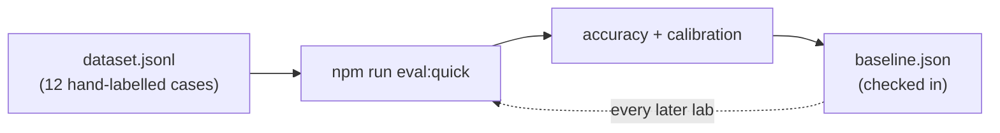

# Lab 0 — Establish your evaluation baseline

**Time:** 20 minutes · **Prerequisites:** [Setup](../setup.md) complete

> **What this is:** an evaluation baseline is a recorded “before” measurement
> for your AI feature. You will run a small, hand-labelled test set, save its
> result, and use it to tell whether a later prompt or model change actually
> helped. It is not a competition and it does not grade you.

## Why this matters

In March 2026, before any of this existed, Northwind's platform team tried to
improve their first classifier by editing its prompt. The change was small and
obviously correct: they added three sentences clarifying what counted as
"urgent," because too many merely-annoyed customers were landing in the urgent
queue. Urgent volume dropped 40% the next day. Everyone agreed it worked.

Eleven days later a support lead noticed that safety reports had stopped
arriving in the safety queue. The same three sentences that made the model
stingier about "urgent" had also made it stingier about escalation, and nobody
had a number that would have caught it. They had a before and an after, but
the before was a feeling.

This is the ordinary failure mode of prompt work. A prompt change is not a code
change: it has no type checker, no compiler, and no stack trace. It has one
safety net, and the net has to exist *before* you start editing or it catches
nothing. So you are going to build it before you write a single prompt.

The other reason to start here is more uncomfortable. You are about to
hand-label three real tickets, and you will find that you and the person next
to you disagree about at least one. That disagreement is not a warm-up
exercise — it is the actual difficulty of this problem domain, and you should
meet it in minute five rather than in Lab 6.

---

> **See the queue this scores against.** The twenty tickets in
> [`data/inbound-queue.json`](../../data/inbound-queue.json) are real inputs to
> this service, and the [queue playground](https://triage.mlynn.dev/playground/queue)
> shows them before and after triage.

## Objectives

By the end you can:

- Run a scored eval against a hand-labelled gold set and read the result
- Explain what the confidence gap measures and why it beats raw accuracy
- Defend a scoring choice you disagree with
- Name what a twelve-case set can and cannot detect



---

## Step 1 — read the cases before you run anything

Open [`evals/dataset.jsonl`](../../evals/dataset.jsonl). Twelve lines, one JSON
object each: a `message`, the `expected` labels, and a `notes` field saying
which rule that case exists to test.

```bash
cat evals/dataset.jsonl | jq -r '"\(.id)  \(.expected.category)/\(.expected.urgency)  \(.notes)"'
```

Read the `notes` on `eval-03` and `eval-08`. Neither case is here because it is
typical. Each is here because it sits on a line where two handbook rules touch.

**Q1.** Twelve cases is small. Argue *for* it — what does a hand-labelled set
lose when it grows to two hundred?

## Step 2 — label three tickets yourself, first

Before you run anything, open
[`data/inbound-queue.json`](../../data/inbound-queue.json) and find
`NW-T-1045`, `NW-T-1047`, and `NW-T-1060`. For each one, write down on paper:
category, urgency, and whether it requires a human.

Do this alone, then compare with the person next to you. Do not skip the
comparison — it is the point of the step.

```bash
jq -r '.[] | select(.id | IN("NW-T-1045","NW-T-1047","NW-T-1060")) | "\(.id)\n\(.subject)\n\(.message)\n"' data/inbound-queue.json
```

**Q2.** Which of the three did you disagree on, and was the disagreement about
the *ticket* or about the *definition*? Keep your answer — Lab 6 comes back to
it.

## Step 3 — put a number on the board

```bash
npm run eval:quick
```

About a minute and roughly **$0.09** on a warm cache (nearer $0.12 cold). You
get a `PASS`/`FAIL` line per case, an accuracy figure, and two confidence
numbers.

The first run reports `no baseline yet`. Record one:

```bash
npm run eval:quick -- --save
```

That writes [`evals/baseline.json`](../../evals/baseline.json), which is
**checked into git on purpose**. From here on, every prompt change you make in
this course produces a diff on that file. The diff is the evidence.

**Q3.** The runner reports mean confidence on passes and on failures
separately, and calls the difference the "gap." Why is the gap more useful than
either number alone?

## Step 4 — argue about `eval-11`

One case is labelled *deliberately ambiguous*. Find it:

```bash
grep eval-11 evals/dataset.jsonl | jq .
```

It may pass or fail on any given run. What it does reliably is score around
**0.45–0.48** confidence, against roughly **0.85** on the cases that pass.

That is not the model being unreliable. That is the model being unsure exactly
where a careful human would also be unsure — which is the property that makes
`confidence` useful for threshold routing rather than decorative.

Now find the *other* case that flips. Run the baseline evaluation twice more.

**Q4.** This repo scores between 10/12 and 12/12 across runs with nothing
changed. `eval-11` flips at ~0.46 confidence; `eval-03` flips at ~0.71. One of
those is caught by a confidence threshold at 0.6 and one is not. What does that
tell you about shipping confidence as your only safety control?

**Q5.** Given a two-case run-to-run spread, what is the smallest improvement
this set could actually detect? What would you do if you needed to detect one
smaller than that?

```quiz
[
  {
    "question": "Your eval accuracy is 11/12. One case fails. What do you check first?",
    "options": [
      "The system prompt \u2014 the model clearly misunderstood the rule",
      "The label \u2014 the gold set is a spec and specs have bugs",
      "The schema \u2014 a field description is probably underspecified"
    ],
    "answer": 1,
    "explain": "The first run of this exact dataset scored 58%, and five of the six failures were LABEL errors. `requested_remedy` had been labelled with the remedy the customer should GET, while the schema asks what they explicitly ASKED FOR. Fixing the labels moved the score without touching a line of prompt or code. In mature systems a real share of failures are mislabelled cases.",
    "note": "That is why `npm run eval:quick` prints each failing case's `notes` field."
  },
  {
    "question": "A prompt change moves your score from 10/12 to 11/12. What have you learned?",
    "options": [
      "The change was an improvement",
      "Almost nothing \u2014 one case is 8% of a 12-case set",
      "The change was an improvement, but only for that category"
    ],
    "answer": 1,
    "explain": "With n=12, a single case is 8.3 percentage points. A one-case move is inside the noise of ordinary run-to-run variation, so it cannot distinguish a real improvement from a coin flip. What it CAN do is tell you which specific case moved \u2014 and `eval:quick` prints exactly that under `regressed:` and `newly passing:`. The named case is the signal; the score is not.",
    "note": "Sizing a set to support a rate claim is Lab 6 Q7."
  }
]
```

## Step 5 — notice what is not scored

The scorer compares four fields: `category`, `urgency`, `requires_human`, and
`entities.requested_remedy`. Every response also carries `sentiment` and
`summary`, and **neither is scored by anything**.

That is a deliberate choice, recorded in
[`evals/lib/score.ts`](../../evals/lib/score.ts). Before you read the
reasoning there, form your own view.

**Q6.** Defend the choice not to score `summary`. Then argue against it. Which
side would you actually ship?

**Q7.** `eval:quick` is deterministic and skips the LLM judge. `npm run eval`
adds the judge for roughly double the cost. The two are closer in price than
you might expect, so cost is **not** the reason to prefer one. What is?

---

## Checkpoint

You should be able to answer, without looking anything up:

- [ ] What does the confidence gap measure, and why not just accuracy?
- [ ] When an eval case fails, what do you check before the model?
- [ ] What can a 12-case set detect, and what can it not?
- [ ] Which flipping case does a 0.6 confidence threshold miss, and why?
- [ ] Why is `summary` unscored?

---

## Extension

Write a thirteenth case and add it to `dataset.jsonl` with a `notes` field
saying which rule it tests. Make it one you expect the system to **fail** —
a case the current prompt gets wrong is worth ten that it already handles. Run
`npm run eval:quick` and watch your accuracy drop. Do not fix it yet; you will
come back to it in Lab 2.

**Answers:** [../solutions/lab-0.md](../solutions/lab-0.md)
