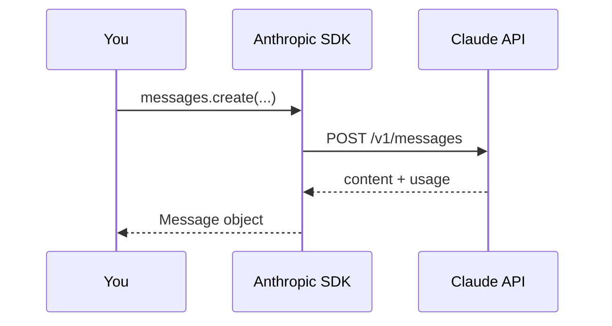

# Lab 1 — Your first call, and reading `usage`

**Time:** 20 minutes · **Prerequisites:** Node 20+, an Anthropic API key

## Why this matters

Nothing in this lab looks consequential. One call, four numbers, a truncated
sentence.

But the four numbers in `usage` are the entire reason this project has a budget
at all. Priya has about $4,000 a month against 45,000 peak-week tickets, and the
policy handbook goes out on every single request. If you cannot read a `usage`
block, you cannot tell the difference between a system that fits that budget and
one that costs ten times more while returning identical answers. That difference
is invisible in the response body. It only shows up in these four fields.

And `stop_reason` is how you find out the model stopped mid-sentence. In a
support context that is a reply to a customer that ends halfway through a
refund amount.

---

## Objectives

By the end you can:

- Make a Messages API call with the TypeScript SDK
- Narrow a `ContentBlock` union correctly (the first thing TypeScript stops you on)
- Read all four `usage` fields and explain what each one costs
- Recognize `stop_reason: "max_tokens"` and know what to do about it



---

## Setup

```bash
npm install && cp .env.example .env
```

Put your key in `.env`, then:

```bash
export $(grep -v '^#' .env | xargs)
```

Verify:

```bash
curl -s localhost:8787/healthz || npm run dev
```

---

## Step 1 — the smallest possible call

Create `scratch/hello.ts`:

```ts
import Anthropic from "@anthropic-ai/sdk";

const client = new Anthropic();

const response = await client.messages.create({
  model: "claude-opus-5",
  max_tokens: 1024,
  messages: [{ role: "user", content: "In one sentence: what is a zipper slider?" }],
});

console.log(response);
```

```bash
npx tsx scratch/hello.ts
```

**Look at the raw response object before you go further.** Note that `content`
is an *array*, that `usage` is present, and that `stop_reason` is `"end_turn"`.

## Step 2 — extract the text (and hit the type error)

Add this and watch TypeScript complain:

```ts
console.log(response.content[0].text);
```

`content` is `ContentBlock[]`, a discriminated union — a block may be `text`,
`thinking`, `tool_use`, and more. You must narrow:

```ts
for (const block of response.content) {
  if (block.type === "text") console.log(block.text);
}
```

> **Why this matters:** on Opus 5, adaptive thinking is on by default, so
> `content[0]` is frequently *not* the text block. Code that indexes position 0
> works in testing and breaks the moment reasoning kicks in.

```quiz
[
  {
    "question": "Why can't you write `response.content[0].text`?",
    "options": [
      "The SDK returns text on a different property",
      "`content` is an array of blocks that may be text, thinking, or tool_use — you have to narrow by `.type`",
      "You need to await it first"
    ],
    "answer": 1,
    "explain": "`content` is a discriminated union. On Opus 5 adaptive thinking is on by default, so index 0 is frequently a `thinking` block — code that indexes position 0 works in testing and breaks the moment reasoning kicks in.",
    "note": "TypeScript will stop you. In JavaScript it fails silently at runtime instead."
  }
]
```

## Step 3 — read the meter

```ts
console.log({
  input: response.usage.input_tokens,
  output: response.usage.output_tokens,
  cache_write: response.usage.cache_creation_input_tokens,
  cache_read: response.usage.cache_read_input_tokens,
});
```

At Opus 5 list price ($5/M input, $25/M output), compute the cost of that call
by hand. Then check yourself against the running service:

```bash
curl -s localhost:8787/v1/estimate -H 'content-type: application/json' \
  -d '{"message":"In one sentence: what is a zipper slider?"}' | jq .cost_usd
```

**Q1.** Why is the estimate's input count so much larger than your script's?

## Step 4 — break it on purpose

Set `max_tokens: 20` and ask for something long:

```ts
const truncated = await client.messages.create({
  model: "claude-opus-5",
  max_tokens: 20,
  messages: [{ role: "user", content: "Explain waterproof-breathable membranes." }],
});
console.log(truncated.stop_reason);
```

You get `"max_tokens"` and a sentence that stops mid-word. **There is no error.**
The request succeeded; the output is just wrong.

**Q2.** A teammate proposes catching this by checking whether the response ends
in a period. Why is that a bad detector, and what's the correct one?

```quiz
[
  {
    "question": "Your response comes back with `stop_reason: \"max_tokens\"`. What happened?",
    "options": [
      "The request failed and you should retry it",
      "The model finished early because it had nothing more to say",
      "The output was cut off mid-generation \u2014 the call succeeded, the answer is just truncated"
    ],
    "answer": 2,
    "explain": "`max_tokens` is an enforced ceiling the model cannot see. Hitting it truncates the output mid-thought. There is no error: HTTP 200, a valid response object, and a sentence that stops halfway.",
    "note": "In a support context that is a reply to a customer that ends partway through a refund amount."
  }
]
```

## Step 5 — handle errors like the service does

Read [`src/lib/errors.ts`](../../src/lib/errors.ts). Then reproduce a real
failure:

```bash
ANTHROPIC_API_KEY=sk-ant-nope npx tsx scratch/hello.ts
```

**Q3.** `src/lib/errors.ts` maps `AuthenticationError` to HTTP **500**, not
401. Argue for that choice in one sentence.

---

## Checkpoint

You should be able to answer, without looking anything up:

- [ ] Why can't you write `response.content[0].text`?
- [ ] What are the four `usage` fields and their relative costs?
- [ ] What is `stop_reason: "max_tokens"` and how do you detect it?
- [ ] Which error classes are retryable?

---

## Extension

Wrap your script in a loop that calls the API 3× and prints total cost. Then
add `cache_control` to the system prompt and observe that nothing changes —
your prompt is too short to cache. That failure is the setup for Lab 5.

**Answers:** [../solutions/lab-1.md](../solutions/lab-1.md)
