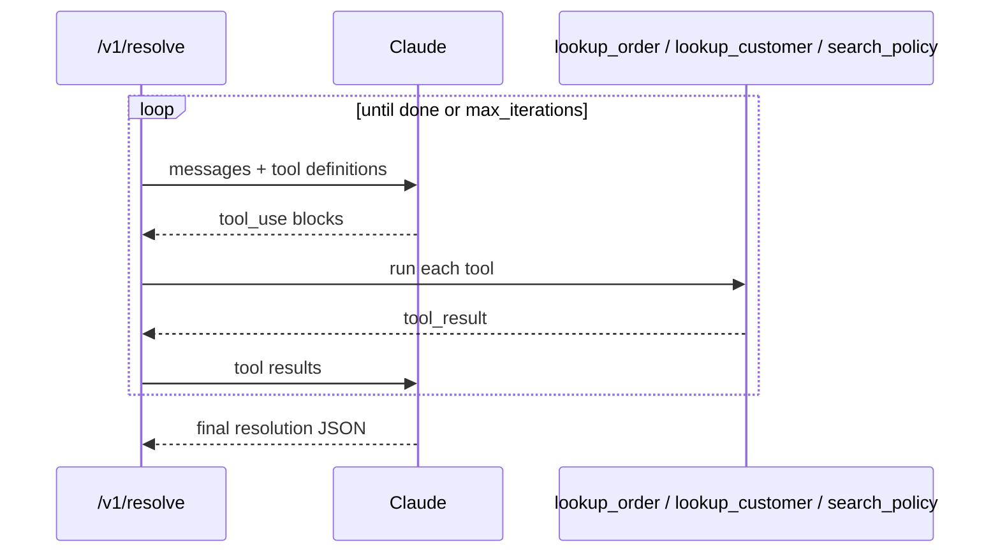
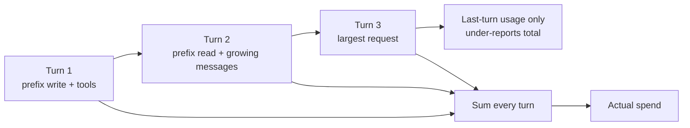

# Lab 3 — Tool use and the agentic loop

**Time:** 45 minutes · **Prerequisites:** Lab 2

## Why this matters

A wrong recommendation here moves real money.

The $200 agent authority ceiling exists because in 2024 an agent under pressure
refunded $4,800 across six transactions to one upset customer. The system you
build in this lab makes recommendations that a busy agent will approve, and
Marco — six years in, handles the hard tickets — has one specific fear about it:
that it will confidently hand him something wrong and his name will be on the
approval.

That fear is the design brief. It is why the model looks up the order instead of
believing the customer's account of it, why it reads policy instead of reasoning
about what seems fair, and why `/v1/resolve` returns the full tool trace. A
supervisor has to be able to reconstruct the decision six months later. The last
system got cancelled for exactly this.

The tool descriptions you write in Step 2 are not documentation. They are the
control surface for whether the model checks its facts.

---

```try
{
  "tool": "trace",
  "title": "Step through the loop first",
  "lead": "Walk a real three-turn /v1/resolve run. Watch the context grow, then check whether the last turn's usage is the whole bill. No key, no server.",
  "href": "/playground/trace"
}
```

## Objectives

- Define a tool with `betaZodTool` and run the loop with `toolRunner`
- Diagnose a "the model ignored my tool" bug as a description bug
- Explain why usage must be summed across turns
- Cap an agent loop, and know what happens when the cap is hit



### The usage trap

Each turn resends the whole conversation. Input tokens grow; the last turn is
usually the most expensive. Reporting only that turn's `usage` under-reports
spend — and not by a neat 1/N factor.



---

## Step 1 — watch it think

```bash
curl -s localhost:8787/v1/resolve -H 'content-type: application/json' -d '{
  "message":"UPS says NW-48211 was delivered but nothing is on my porch.",
  "customer_email":"dana.k@example.com"
}' | jq '{resolution, tools: [.tool_trace[].tool], iterations: .meta.iterations}'
```

```receipt
{
  "title": "Three-turn /v1/resolve — summed",
  "note": "Representative shape from the stepper. Last-turn usage alone is not this total.",
  "input": 890,
  "output": 312,
  "cacheWrite": 4711,
  "cacheRead": 9422,
  "cost": "$0.042"
}
```

You did not tell Claude which tools to call. Read the trace order and reconstruct
its reasoning: why did it call those tools, in that sequence?

**Q1.** The system prompt in `src/prompts.ts` prescribes a 4-step method
("look up orders → look up account → search policy → decide"). What would you
expect to change about the trace if you deleted that method, and why might the
answer still be correct but less *auditable*?

## Step 2 — break a tool description

In [`src/tools/index.ts`](../../src/tools/index.ts), replace `lookup_order`'s
description with the naive version:

```ts
description: "Looks up an order.",
```

Re-run the request from Step 1 several times.

**Q2.** What changed in the trace? Most "the model won't use my tool" reports
are description bugs. State the rule the original description follows that the
naive one doesn't.

Restore it before continuing.

## Step 3 — the usage trap

`src/routes/resolve.ts` iterates the runner instead of awaiting it:

```ts
// src/routes/resolve.ts
for await (const message of runner) {
  usagePerTurn.push(summarizeUsage(message.usage, message.model));
}
const final = await runner.done();
```

Compare what the two reporting strategies would tell you:

```bash
curl -s localhost:8787/v1/resolve -H 'content-type: application/json' \
  -d '{"message":"Where is NW-51907? It has not moved in nine days."}' \
  | jq '{turns: .meta.iterations,
         total: .meta.usage_total.estimated_cost_usd,
         last_turn_only: .meta.usage_per_turn[-1].estimated_cost_usd}'
```

**Q3.** Express the under-reporting factor in terms of turn count. Why is the
error *not* simply `1/turns`? (Look at how `total_input_tokens` grows per turn.)

```quiz
[
  {
    "question": "A 5-turn agentic loop finishes. You log `usage` from the final message. How wrong is your cost figure?",
    "options": [
      "Correct \u2014 the final message reports the whole run",
      "Off by about 1/5, since there were five turns",
      "Off by roughly 3x, because history accumulates and the last turn is the largest"
    ],
    "answer": 2,
    "explain": "Each turn resends the whole conversation, so input grows with every iteration and the final turn is the most expensive one. Reporting only that turn under-reports by less than 1/N \u2014 but still badly.",
    "note": "The stepper at /playground/trace walks a real three-turn run showing exactly this."
  },
  {
    "question": "Claude keeps ignoring your `lookup_order` tool and trusting what the customer said instead. Where is the bug?",
    "options": [
      "The tool description \u2014 it says what the tool returns but not when to call it",
      "The model needs a more capable tier",
      "You need to force it with `tool_choice`"
    ],
    "answer": 0,
    "explain": "A tool's description is the only documentation Claude ever sees about it. \"Looks up an order\" is a type signature the model already has from the schema. \"Call this before stating any fact about an order \u2014 never rely on what the customer claims\" is a behavioural instruction.",
    "note": "Most \"the model won't use my tool\" reports are description bugs."
  }
]
```

## Step 4 — hit the cap

Set `MAX_ITERATIONS = 2` in `src/routes/resolve.ts` and re-run a question that
needs three lookups.

**Q4.** Check `meta.hit_iteration_cap` and `stop_reason`. The response is
still HTTP 200 with a schema-valid body. Why is that dangerous, and what should
a production service do when `hit_iteration_cap` is true?

Restore `MAX_ITERATIONS = 8`.

## Step 5 — write a tool

Add `check_refund_authority`: given a dollar amount, return whether it is within
the $200 agent limit (handbook clause 2.7) and who must approve it.

```ts
const checkAuthority = betaZodTool({
  name: "check_refund_authority",
  description: /* you write this — say WHEN to call it */,
  inputSchema: z.object({
    amount_usd: z.number().describe("..."),
  }),
  run: record("check_refund_authority", ({ amount_usd }) => {
    // your implementation
  }),
});
```

Add it to the returned array and test with an order over $200 (`NW-52044` is
$640).

**Q5.** Claude could compute `amount > 200` itself without a tool. Give one
good argument for the tool anyway, and one situation where the tool is
overkill.

## Step 6 — re-run the scoreboard

```bash
npm run eval:quick
```

Tool use does not touch `/v1/triage`, so accuracy should be unchanged. Run it
anyway. Knowing which changes *cannot* move the number is half of knowing what
the number means.

---

## Checkpoint

- [ ] What does `toolRunner` do that a manual loop would make you write?
- [ ] Why must `run()` return a string?
- [ ] Why sum usage across turns?
- [ ] What happens when `max_iterations` is reached, and how do you detect it?
- [ ] Scoreboard re-run; you can say why it did or did not move

---

## Extensions

1. **Redaction.** Handbook clause 4.5 requires that card digits never be
   echoed. Work out where redaction belongs before you look at how this repo
   does it, and justify why the boundary — not the prompt — is the right place.
   Then read [`src/lib/untrusted.ts`](../../src/lib/untrusted.ts) and the
   `record()` closure in [`src/tools/index.ts`](../../src/tools/index.ts), and
   see whether you picked the same choke point.
   [Lab 8](lab-8-trust-boundary.md) is the full treatment.
2. **Human-in-the-loop.** Make `check_refund_authority` require approval for
   amounts over $200 by returning a "pending approval" result from inside
   `run()`. Note that you do **not** need a manual loop for this — gate inside
   the tool. Compare your version with
   [`src/lib/authority.ts`](../../src/lib/authority.ts), which does the check
   *after* the loop instead, and decide which placement you prefer and why.

**Answers:** [../solutions/lab-3.md](../solutions/lab-3.md)
