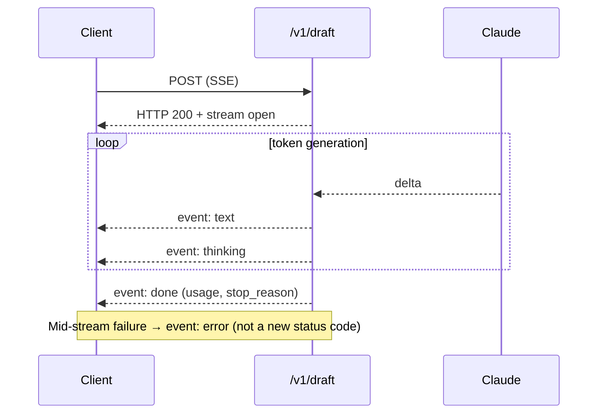

# Lab 4 — Streaming and SSE

**Time:** 30 minutes · **Prerequisites:** Lab 1

## Why this matters

Everything in this lab is in service of Marco not sending a bad reply.

The draft route writes to a customer, and the customer might be the person whose
daughter went to urgent care. Tone rules that look fussy on paper — lead with the
resolution, one apology, never promise a refund "today" — are each there because
a version of that message went out and made things worse. The 5–7 day language
exists because agents kept promising same-day refunds and customers kept
escalating on day two.

Streaming matters for a narrower reason: an agent will not wait fifteen seconds
staring at a spinner during a December shift with 11,000 tickets in the queue.
They will alt-tab, and the draft will sit unread. Perceived latency is the
difference between a tool that gets used and one that gets abandoned.

The two production details in Steps 4 and 6 — proxy buffering and client
disconnects — are how this feature works in your dev environment and fails in
theirs.

---

## Objectives

- Stream a response and handle the event types you actually care about
- Get `usage` out of a stream (it isn't there until the end)
- Handle errors that occur *after* the HTTP status is already 200
- Abort an upstream stream when the client disconnects



---

## Step 1 — watch tokens arrive

```bash
curl -N -s localhost:8787/v1/draft -H 'content-type: application/json' -d '{
  "message":"My Trail Club membership renewed but I cancelled in June. I want the $89 back."
}'
```

`-N` disables curl's buffering. Without it you see the whole reply at once and
conclude streaming is broken — a preview of Step 4.

## Step 2 — the event taxonomy

Read [`src/routes/draft.ts`](../../src/routes/draft.ts). The route emits four
event types:

| Event | Carries | A UI should |
|---|---|---|
| `text` | reply delta | append to the message body |
| `thinking` | summarized reasoning delta | render in a collapsed panel |
| `done` | `stop_reason`, `usage` | stop the spinner, log cost |
| `error` | error body | show a failure state |

Now comment out `display: "summarized"` in the `thinking` config and re-run.

**Q1.** The `thinking` events still arrive but carry empty text. Given that
thinking happens and is billed identically either way, what exactly does
`display` control — and why does the default (`"omitted"`) produce a bad
first-run UX?

## Step 3 — get the cost

`usage` is not available mid-stream. It arrives at the end:

```ts
// src/routes/draft.ts
const final = await stream.finalMessage();
send("done", {
  stop_reason: final.stop_reason,
  model: final.model,
  usage: summarizeUsage(final.usage, final.model),
});
```

**Q2.** A teammate proposes wrapping `stream.on("message", ...)` in a
`new Promise()` to capture the final message. Why is `finalMessage()` the
correct tool, and what states does it handle that the hand-rolled promise
would not?

## Step 4 — the production failure you will hit

Everything above works locally. Deployed behind nginx with default settings,
the client receives the entire reply in one chunk after full generation.

Look at `SSE_HEADERS` in [`src/lib/sse.ts`](../../src/lib/sse.ts).

**Q3.** Which header prevents this, and why is `Cache-Control: no-transform`
also there? Name one other layer between your service and the browser that can
buffer a stream.

```quiz
[
  {
    "question": "Your streaming endpoint fails upstream halfway through generating. What does the client see?",
    "options": [
      "A 502, because the request failed",
      "HTTP 200 with a half-written response, unless you emit an error event in-band",
      "The connection drops and fetch throws"
    ],
    "answer": 1,
    "explain": "By the time generation starts, the status line is already sent. A mid-stream failure cannot be expressed as a non-2xx response, so it has to be delivered as an in-band event the client explicitly handles.",
    "note": "A client that only checks `res.ok` will show a truncated customer reply as if it were complete."
  }
]
```

## Step 5 — errors after 200

Simulate an upstream failure mid-stream. Easiest reproduction: start the server
with a valid key, begin a request, then note that `src/routes/draft.ts` catches
inside the `ReadableStream` and emits an in-band `error` event.

**Q4.** By the time generation starts, the HTTP status is already 200. Write
the one-sentence rule a client integrator must follow, and explain what breaks
if they only check `res.ok`.

## Step 6 — hang up

```ts
c.req.raw.signal.addEventListener("abort", () => stream.abort());
```

Start a request and kill curl mid-generation (Ctrl-C).

**Q5.** Without this line, what continues to happen, and who pays for it?

## Step 7 — re-run the scoreboard

```bash
npm run eval:quick
```

Streaming is a delivery change, not a reasoning change. If the score moved,
something other than delivery changed and you want to know what.

---

## Checkpoint

- [ ] Which `content_block_delta` delta types matter, and what do they mean?
- [ ] How do you get `usage` from a stream?
- [ ] Why can't a mid-stream error be an HTTP error?
- [ ] What must you do on client disconnect?
- [ ] Scoreboard re-run; you can say why it did or did not move

---

## Extension

Build a 40-line HTML page that consumes `/v1/draft` with `EventSource` (note:
`EventSource` is GET-only, so you will need `fetch` + a `ReadableStream` reader
for a POST body — discovering that is part of the exercise). Render `text` into
the body and `thinking` into a `<details>` element.

**Answers:** [../solutions/lab-4.md](../solutions/lab-4.md)
