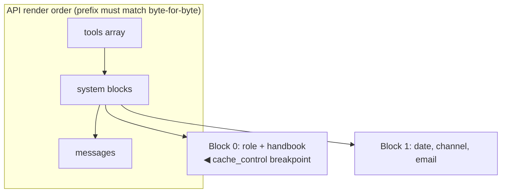

# Lab 5 — Prompt caching and cost

**Time:** 35 minutes · **Prerequisites:** Labs 1–2

## Why this matters

This lab is the difference between the project shipping and not shipping.

The arithmetic is not subtle. Priya's budget is roughly $4,000 a month. Peak
week is 11,300 tickets, about 45,000 in a peak month. That is just under nine
cents per ticket for everything — triage, resolution, and a drafted reply.

The cached prefix — role instructions plus the full handbook — measures about
3,400 tokens, and it goes out on every request,
because legal changes it weekly and it cannot be baked into a prompt. Priced at
full input rate on every call, the handbook alone consumes the entire budget
before you have generated a single word of output.

Caching that prefix is what makes the unit economics work. And the failure mode
you will spend most of this lab on is the reason it deserves a whole lab: every
way of breaking the cache succeeds silently. HTTP 200, correct answer, bill
roughly ten times what you planned. Nobody notices until finance does.

---

> **Try it without setting anything up.** The
> [cost explorer](https://triage.mlynn.dev/playground/cost) and
> [spot the cache bug](https://triage.mlynn.dev/playground/cache)
> are interactive versions of Steps 1, 2 and 5. No key, no server.

## Objectives

- Get a cache hit, and prove it with `cache_read_input_tokens`
- Break the cache four different ways and recognize each signature
- Decide where a breakpoint belongs
- Reason about when caching *loses* money



---

## Step 1 — a cold call and a warm one

```bash
npm run smoke 2>&1 | grep -A12 "call 2"
```

The second call should report `cache_hit: true` with several thousand
`cache_read_input_tokens`.

**Q1.** The first call shows `cache_creation_input_tokens` and the second shows
`cache_read_input_tokens`, both large, while `input_tokens` stays small on
both. Explain what each field is counting, and compute the cost difference.

## Step 2 — break it (four ways)

Read [`src/prompts.ts`](../../src/prompts.ts). Then break the cache
deliberately, one change at a time, running `npm run smoke` after each and
recording whether `cache_hit` survives.

**Break A — a timestamp in the prefix.** In `buildSystem`, change the frozen
block to:

```ts
text: `Generated at ${new Date().toISOString()}\n${roleText}\n\n---\n\n${POLICY_HANDBOOK}`,
```

**Break B — move the breakpoint.** Put `cache_control` on the *volatile* block
instead of the frozen one.

**Break C — shorten the prefix.** Replace `POLICY_HANDBOOK` with
`POLICY_HANDBOOK.slice(0, 1500)` (~350 tokens).

**Break D — reorder tools.** In `src/tools/index.ts`, return the tools array
reversed, then hit `/v1/resolve` twice.

**Q2.** For each break, record: does `cache_hit` go false? Is there an error?
Which is the most dangerous in production, and why?

Restore everything.

> **The signature of a cache bug is silence.** Every break above succeeds with
> HTTP 200 and a correct answer. The only symptom is a bill roughly 10× what
> you budgeted. `cache_read_input_tokens` is your only detector — alert on it.

```quiz
[
  {
    "question": "Someone adds `Today is ${new Date().toISOString()}` to the top of the cached system block. What breaks?",
    "options": [
      "The request errors with an invalid cache_control",
      "Nothing \u2014 the date is small compared with the handbook",
      "Every request misses the cache, silently, at roughly 10x the intended cost"
    ],
    "answer": 2,
    "explain": "Caching is a prefix match. Any byte change anywhere in the prefix invalidates everything after it. The request still succeeds and the answer is still correct \u2014 the only symptom is the bill.",
    "note": "`cache_read_input_tokens` staying at zero is the one detector you have. Alert on it."
  },
  {
    "question": "You cache a 3,400-token prefix for a tenant that sends one ticket a day. What happens to cost?",
    "options": [
      "It drops ~90%, as caching always does",
      "It rises about 25%, because you pay the write premium and never get a read",
      "It stays the same"
    ],
    "answer": 1,
    "explain": "Cache writes cost ~1.25x and reads ~0.1x, against 1.0x uncached. With the default 5-minute TTL, one request per day means every single call pays the write premium and the entry expires unused.",
    "note": "Caching wins from the first reuse inside the TTL window \u2014 the question is whether you get one."
  }
]
```

## Step 3 — the 1024-token floor

```bash
curl -s localhost:8787/v1/estimate -H 'content-type: application/json' \
  -d '{"message":"test","role":"triage"}' | jq .tokens
```

**Q3.** `prefix_meets_cache_minimum` is computed against 1024. What happens if
you set a breakpoint on a 400-token prefix — error, warning, or silence? What
does that imply about how you validate a caching change before shipping it?

## Step 4 — where does the breakpoint go?

Render order is `tools → system → messages`. You have four content categories:

1. A 40K-token product catalog, identical for all users
2. A 3K-token per-tenant policy override, stable within a tenant
3. Conversation history, growing each turn
4. The current user message

**Q4.** Sketch the ordering and place up to 4 breakpoints. Which category
must come last, and why does putting the growing history *before* the
per-tenant block cost you money?

## Step 5 — when caching loses

```bash
curl -s localhost:8787/v1/estimate -H 'content-type: application/json' -d '{
  "message":"Where is my order?",
  "monthly_volume":10000
}' | jq .monthly_projection_usd
```

Cache writes cost ~1.25× fresh tokens; reads cost ~0.1×. The default TTL is
5 minutes.

**Q5.** At what request rate does caching start losing money? Derive the
break-even in terms of requests-per-TTL-window, then name a real traffic
pattern in this support domain where you would deliberately *not* cache.

## Step 6 — spend the savings

`src/config.ts` sets `EFFORT.triage = "low"`. Change it to `"high"` and run:

```bash
npm run eval 2>&1 | tail -12
```

**Q6.** Compare accuracy and total cost against the `low` baseline. If accuracy
is unchanged, what have you learned about this task — and what would you need
to see before spending the extra tokens?

## Step 7 — re-run the scoreboard

```bash
npm run eval:quick
```

This one matters. If you left Break C in place, the cached prefix is broken and
you may see cost climb without accuracy moving at all — which is exactly the
production failure the lab is about. `git diff` before you conclude anything.

---

## Checkpoint

- [ ] What is the one field that proves caching is working?
- [ ] Name three silent invalidators.
- [ ] What is the minimum cacheable prefix, and what happens below it?
- [ ] When is caching a net loss?
- [ ] Scoreboard re-run; you can say why it did or did not move

---

## Extension

Add a `cache_hit_rate` counter to the service and expose it at
`GET /metrics`. Then write the alert rule you would page on. (Hint: the rule is
not "hit rate < 100%" — cold starts are legitimate. What is the actual
signal?)

**Answers:** [../solutions/lab-5.md](../solutions/lab-5.md)
