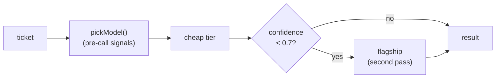

# Lab 7 — Choosing a model

**Time:** 45 minutes · **Prerequisites:** Lab 0, Lab 2, Lab 6

## Why this matters

Everything you have built so far runs on `claude-opus-5`, because
`src/config.ts` says so and nobody questioned it. That is the most expensive
model in the lineup, doing a bounded classification task, 4,100 times a week.
Stated that way it sounds obviously wrong, and every cost-optimization article
you have ever read is about to tell you to move down a tier.

This lab is going to talk you out of that — not on principle, but on
measurement, and not in the direction you expect.

In April 2026 a team at a company much like Northwind moved their classifier
from a flagship model to a cheap one. Accuracy dropped from 94% to 89%, which
they accepted: five points for an 80% cost cut looked like a good trade on the
slide. What the slide did not say was *which* five points. The cases the cheap
model lost were disproportionately the ones where two policy rules touched —
and "two rules touch" is a fair description of every case that matters. The
routine ones were routine for both models.

They also kept their confidence-threshold escalation in place, and it kept
reporting that everything was fine. It was not. That part is the most useful
thing in this lab, and you will measure it yourself in Step 3.

---

```try
{
  "tool": "models",
  "title": "See the matrix without running it",
  "lead": "A checked-in eval:models run — accuracy, calibration gap, and the per-case disagreement grid. The cheap tier's failures concentrate where two rules touch.",
  "href": "/playground/models"
}
```

## Objectives

By the end you can:

- Run the same gold set across tiers and read a disagreement matrix
- Explain why a pinned judge is a precondition for the comparison, not a detail
- Implement confidence-based escalation and say when it does not work
- Make a model decision from evidence and write down what would change it



---

## Step 1 — run the matrix

```bash
npm run eval:models -- --models claude-opus-5,claude-sonnet-5,claude-haiku-4-5 --no-judge
```

The default is two tiers, Opus 5 as flagship and Sonnet 5 as the cheap tier.
This command adds Haiku 4.5 back on purpose, because the reasons it is no longer
a tier are the most useful thing in this lab. Three models, twelve cases, four
in flight. About ninety seconds and $0.22.

> **Why there is no `fast` tier.** This repo used to route short tickets to
> `claude-haiku-4-5`. It was dropped for three measured reasons you will
> reproduce below: it cannot cache this prefix, it rejects `effort`, and its
> wrong answers come back at high confidence. There is also a date on it:
> `claude-haiku-4-5` is an alias for `claude-haiku-4-5-20251001`, and Anthropic
> commits to serving Haiku 4.5 only until **no sooner than October 15, 2026**.
> `claude-opus-5` and `claude-sonnet-5` are pinned snapshots with retirement
> dates in 2027. A tier choice includes how long you get to keep it; see the
> [model deprecations](https://platform.claude.com/docs/en/about-claude/model-deprecations)
> page.

Read the table top to bottom before you read any single column. One run on
this repo, 2026-09-15, checked in as
[`website/src/data/model-matrix.json`](../../website/src/data/model-matrix.json):

| model | effort | accuracy | p50 | p95 | $/ticket | $/mo @ 4,100/wk | calibration gap | prefix cached? |
|---|---|---|---|---|---|---|---|---|
| `claude-opus-5` | low | 11 / 12 | 3.3s | 5.5s | $0.0074 | ~$132 | 0.44 | yes |
| `claude-sonnet-5` | low | 9 / 12 | 2.7s | 4.4s | $0.0068 | ~$121 | 0.05 | yes |
| `claude-haiku-4-5` (dropped) | n/a | 8 / 12 | 3.7s | 4.2s | $0.0040 | ~$71 | 0.22 | **no** |

One run is one sample. This set moves by up to two cases run-to-run with
nothing changed, and the calibration gap moves more than that: across four
earlier runs Opus ranged 0.35–0.41, Sonnet 0.20–0.30, and Haiku −0.06 to
+0.13. Read the gaps as "large, small, unreliable", not as three-digit facts.

The latency columns come from the same run and almost nobody reads them either.
Two things about how they were measured, because a latency number without its
conditions is decoration: models run **sequentially** so one tier's traffic
never queues behind another's, and cases run **four in flight** within a model,
so these include some self-contention and are not single-request figures. They
are also whole-request times through the local route, not time-to-first-token —
`/v1/triage` does not stream, and for a classifier that is the number that
matters.

### The cost column is lying to you, twice

Start with Haiku, the dropped tier. It appears to cost about half as much as
Opus. Stop on that number, because it does not survive five seconds of
arithmetic. Haiku 4.5 is **$1/$5** per MTok against Opus 5's **$5/$25** — five
times cheaper per token. A tier that is five times cheaper per token is not
half the price unless something else is going on.

Something else is going on. Work it out before reading further:

```bash
curl -s localhost:8787/v1/estimate -H 'content-type: application/json' \
  -d '{"message":"test","role":"triage"}' | jq '{tokens, meta}'
```

Now point the whole service at Haiku and run the smoke test, which
makes two identical-prefix calls and asserts on `cache_hit`:

```bash
TRIAGE_MODEL=claude-haiku-4-5 npm run smoke
```

It **fails**, and the failure is the finding:

```
"cache_minimum_tokens": 4096,
"prefix_meets_cache_minimum": false,
"warning": "The cacheable prefix is 2749 tokens, below the 4096-token
            minimum for claude-haiku-4-5. The cache_control breakpoint will
            be accepted and ignored: no error, no cache."
...
cache_creation_input_tokens: 0
cache_read_input_tokens: 0
cache_hit: false          ← on BOTH identical calls
```

The breakpoint is accepted and ignored: HTTP 200, correct answers,
`cache_read_input_tokens: 0`, forever. Every Haiku row in this lab paid full
input rate on the handbook, on every one of those twelve cases.

Note the prefix is **2,749** tokens here, not the ~3,400 you saw on Opus 5.
Nothing about the prompt changed — models tokenize differently, so even the
size of your prefix is a per-model number. It happens not to matter this time
(both are under 4,096), but a prefix sitting near a boundary could cross it on
a tier change with no diff to the prompt at all.

Two things about how that assertion is built, because both were decided the
hard way.

**It fails rather than warning.** A model that cannot cache is behaving exactly
as designed, so there is a real argument for a passing test and a printed note.
That argument was tried and rejected: "expected" is not "fine". This
configuration pays full input rate on the handbook forever, roughly 3.7× per
ticket what the same prompt costs on a tier that caches, and a green tick on a
wasteful config is precisely how this survives long enough to get printed in a
cost table. It already did exactly that — the table you read in Step 1.

**It does not reproduce the old diagnosis.** An earlier version of this script
asserted against a hardcoded 1,024 and told you a 2,749-token prefix was "under
1024 tokens — lengthen `data/policies.md`". False statement, wrong remedy,
attached to a real failure. Failing is right; blaming the prompt was not. The
prompt is fine. The *pairing* of prompt and model is not, and the message says
so — including "do not lengthen `data/policies.md` to chase the minimum",
because adding 1,347 tokens of policy text to win a cache discount is a real
temptation and a terrible reason to edit a legal document.

The cache-hit assertion in section 3 inverts rather than repeating the failure:
on a model under its minimum, smoke fails if a hit ever *does* appear, since
that would mean `src/config.ts` is stale and this lab's cost table needs
re-deriving.

Start the server on Haiku and watch what it says before you send it
anything:

```bash
TRIAGE_MODEL=claude-haiku-4-5 npm run dev
```

`src/lib/preflight.ts` measures the frozen prefix against the configured
model's minimum on every boot — one free `countTokens` call — and prints a
block telling you caching is off. That check exists because of the bug in this
lab, and it is the only instrument here that fires without anyone first
suspecting a problem.

**Q1b.** The smoke failure above is loud and correct, and it still would not
have caught the original bug: nobody ran smoke against Haiku until someone
already suspected the cost column. Rank the instruments — startup check, CI,
dashboard, code review, smoke test — by how early each one fires. Then say what
the winner knows that the others do not.

Check the arithmetic on the two scenarios at 17,800 tickets a month, using the
representative shape from Lab 5 (112 input, 134 output, 3,358 prefix):

| | prefix | input | output | $/mo |
|---|---|---|---|---|
| Haiku, cache working | 3,358 × $0.10/M | 112 × $1/M | 134 × $5/M | **~$20** |
| Haiku, cache silently off | 3,358 × $1/M | 112 × $1/M | 134 × $5/M | **~$74** |

The measured column says $67–74. That is not "Haiku costs about half as much."
That is Lab 5's silent cache miss, sitting inside a cost table in a different
lab, wearing a tier comparison as a disguise — and it was in this table for
some time before anyone divided $5 by $1 and asked why the answer was not five.

Now the second lie, and it is in the row you would actually ship. Read
`cost_per_ticket` in the checked-in run:

| model | $/ticket, 12-case run | $/ticket, warm single call |
|---|---|---|
| `claude-opus-5` | 0.0074 | 0.0062 |
| `claude-sonnet-5` | 0.0068 | 0.0027 |
| `claude-haiku-4-5` | 0.0040 | 0.0043 |

In the matrix, Sonnet costs **almost the same as Opus** per ticket while its
per-token rate is less than half. There is no version of that which is a
coincidence. Open the run's JSON in `evals/results/` and read the per-case
costs: Sonnet's first four cases cost about $0.014 each and the next eight
about $0.0025–0.004. Four in flight against a cold cache means four requests
race to write the same prefix, and each pays the 1.25× write rate on ~5,000
tokens. Opus had been run minutes earlier, so its entry was already warm. A
twelve-case run is short enough that four cold writes dominate the average.

Warm, one call at a time, the order flips: **cached Sonnet is cheaper per
ticket than uncached Haiku**, despite a rate card that is double. That single
row is most of why the fast tier went away.

> **The transferable habit:** when a cost measurement disagrees with the rate
> card, believe neither until you can explain the gap. The explanation is
> almost always a discount you assumed you were getting.

**Q1a.** At warm rates, moving triage from Opus to Sonnet saves about $63 a
month, and fixing Haiku's cache would have made it cheaper still. Both are
noise against a $4,000 budget. So do these two cost discoveries change the tier
decision at all? Say what they change and what they do not — they are not the
same thing.

**Q1.** Priya's budget is $4,000 a month. Every row above fits inside it with
at least thirty times the headroom. What does that do to the argument
for moving down a tier?

## Step 2 — read the disagreement matrix, not the score

The score tells you how many. The matrix tells you which, and which is the
question you can act on.

Two patterns reproduce across runs. `eval-10`, delivered-not-received under
clause 3.4, fails on both cheaper models in this run and nearly every earlier
one. And `eval-04` — the safety case, a customer reporting that a child
swallowed part of a product — fails on Haiku in this run and in three of four
earlier ones, and has never failed on Opus. Sonnet passed it here.

Neither is random. Both are cases where the correct answer requires holding two
handbook rules at once and preferring the one that is not the obvious reading.

**Q2.** The cheap tier loses cases where two rules interact, and holds its own
on cases with one clear rule. Given Northwind's actual ticket mix, is that a
5% problem or a much larger one? What would you need to measure to answer that
properly?

## Step 3 — the column nobody reads

Look at the calibration gap again. Opus separates its wrong answer from its
right ones by about 0.44. Sonnet, in this run, separates them by **0.05**: it
was wrong on `eval-08` at 0.90 confidence and on `eval-10` at 0.70, which is
where most of its right answers sit too. Earlier runs put Sonnet's gap at
0.20–0.30, so treat this run as a warning rather than a verdict, and treat the
spread itself as the finding: on twelve cases, the cheap tier's calibration is
not stable enough to build on without more data.

Haiku makes the point without needing an aggregate. On `eval-04`, the safety
case, it returns the wrong classification at **0.98 confidence** — the highest
score it gave any case in the run, on the case where being wrong is most
expensive. It did the same at 0.95 in an earlier run.

Now consider what that does to the escalation mechanism you are about to build.
`?escalate=true` re-runs on the flagship when confidence falls below 0.7. That
works exactly to the extent that low confidence predicts a wrong answer.

**Q3.** On a model whose calibration gap is zero, what fraction of wrong
answers does a confidence threshold catch? What does the mechanism actually do
to your bill in that case?

```quiz
[
  {
    "question": "A cheap model scores 8/12 with a calibration gap of 0.02. What does the gap tell you?",
    "options": [
      "That the model is badly tuned and needs a better prompt",
      "That its confidence score carries almost no information about correctness",
      "That it is well calibrated — a small gap means consistent scoring"
    ],
    "answer": 1,
    "explain": "A gap near zero means the confidence distribution on wrong answers overlaps the one on right answers. There is no threshold that separates them, so any routing rule built on that score is a coin flip that costs money. Note the trap in option 3: 'consistent' sounds like a virtue, but consistency here means the score says the same thing regardless of whether the answer is right, which is exactly what makes it useless.",
    "note": "This is why the matrix prints the gap next to accuracy rather than in a footnote."
  },
  {
    "question": "Why does `evals/compare-models.ts` pin JUDGE_MODEL instead of judging with the model under test?",
    "options": [
      "Cost — one flagship judge is cheaper than a judge per tier",
      "Because a moved score would then have two possible causes and you could not tell them apart",
      "Because cheaper models cannot produce structured output"
    ],
    "answer": 1,
    "explain": "If the ruler changes at the same time as the thing being measured, a difference in the result is unattributable: did the tier get worse, or did the grader get more lenient? Pinning the judge makes the comparison single-variable. The run prints both the judge id and a hash of the judge prompt so that two runs graded differently can be detected rather than silently compared. Option 3 is false — every model in the matrix supports structured outputs. (Haiku did throw one schema-validation error on `eval-06` in the 2026-09-15 run, which `/v1/triage` now reports as a 502 `unparseable_output`; that is a failure to count, not a missing capability.)",
    "note": "The same discipline applies to the gold set: change the cases or change the model, never both at once."
  }
]
```

## Step 4 — route before the call

Read [`src/lib/route-model.ts`](../../src/lib/route-model.ts). `pickModel`
inspects the message before spending anything: high-stakes language goes to the
flagship, and everything else goes to the cheap tier. (When there was a Haiku
tier, short messages went there and long ones to Sonnet.)

```bash
curl -s 'localhost:8787/v1/triage?tier=auto' -H 'content-type: application/json' \
  -d '{"message":"Where is my package NW-51907?"}' | jq '.meta.routed'
```

```bash
curl -s 'localhost:8787/v1/triage?tier=auto' -H 'content-type: application/json' \
  -d '{"message":"The bottle lining flaked and my kid swallowed a bit of plastic, probably nothing."}' | jq '.meta.routed'
```

The second one routes to the flagship on the word "swallowed" and never asks a
cheap model for an opinion. That is the mechanism that actually protects
`eval-04`, and notice that it works *because it never consults the model whose
confidence you cannot trust*.

**Q4.** `pickModel` reads untrusted customer text to make its decision. Describe
the message that defeats it. Then say why the failure is quiet rather than loud.

## Step 5 — escalate after the call

```bash
curl -s 'localhost:8787/v1/triage?tier=auto&escalate=true' -H 'content-type: application/json' \
  -d '{"message":"i need a refund on order nw48211 and also my email on the account is wrong can you change it to dana.k@example.com"}' | jq '.meta'
```

Two passes. `meta.escalated` names the model that gave up and the confidence
that triggered it; `meta.usage` is the **sum** of both calls, and
`meta.usage_per_pass` itemizes them.

That summing is not bookkeeping fussiness. A two-pass route that reported only
the second pass would under-report its own cost by the price of the first
call — the same trap `/v1/resolve` documents for tool loops, arriving in a
different disguise.

**Q5.** Escalation fires on the cases the cheap model is unsure about. Step 3
established that on a model with a small calibration gap those are not
reliably the cases it gets wrong. So what is `?escalate=true` worth on Sonnet,
given one run at 0.05 and four earlier runs at 0.20–0.30, and what would you
measure before trusting it?

## Step 6 — write the decision down

You have five numbers per tier and a matrix. Write three sentences: which model
you would ship for Northwind, what evidence supports it, and what single
observation would change your mind.

**Q6.** Two models score 11/12. Is that the same number?

**Q7.** Your three sentences almost certainly did not mention latency. Nothing
in Northwind's queue is waiting on a human — triage runs over tickets nobody
reads in real time — so say what the latency column is worth *here*. Then
change one thing about the product so that the same column becomes the
deciding number, and say which row you would ship then.

---

## Checkpoint

You should be able to answer, without looking anything up:

- [ ] Why does the disagreement matrix beat the accuracy column?
- [ ] What does a calibration gap near zero do to confidence-based routing?
- [ ] Why must the judge be pinned when the model under test varies?
- [ ] Where does `?tier=auto` read untrusted input, and what follows from that?
- [ ] Which model silently loses prompt caching, and how would you have caught it from the cost column alone?
- [ ] Why can a twelve-case run make a cheap tier look as expensive as the flagship?

---

## Extension

The tone judge in this matrix is a **control**, not a per-tier comparison: it
grades `/v1/draft`, which uses the server's configured model regardless of
`--models`. Make it a real comparison. Thread a model override through the
draft route the way `?model=` was threaded through triage, then judge each
tier's prose with the pinned judge. Predict the result first — writing a
customer-facing paragraph is a very different task from classifying one, and
the tier ordering you measured for classification may not survive.

```mistake
[
  {
    "id": "escalate-from-flagship",
    "wrong": "const escalate = confidence < ESCALATE_BELOW;",
    "right": "const escalate = confidence < ESCALATE_BELOW && response.model !== FLAGSHIP_MODEL;",
    "symptom": "A ticket already answered by the flagship is sent to the flagship again whenever it is unsure. The cost doubles and the answer does not change.",
    "why": "Escalation means asking a stronger model. Re-asking the same model the same question pays twice for nothing."
  },
  {
    "id": "escalation-usage-last-pass",
    "wrong": "const usage = second ? second.usage : first.usage;",
    "right": "const passes = second ? [first, second] : [first];\nconst usage = passes.map((p) => p.usage); // every billed call, summed when reported",
    "symptom": "An escalated ticket reports only the flagship call's cost. The cheap first pass is paid for and never counted.",
    "why": "A two-pass route makes two billed calls. Reporting the last one is the same under-count as reading the final turn's usage in a tool loop."
  },
  {
    "id": "usage-priced-at-config-model",
    "wrong": "const cost = costOf(response.usage, MODEL);",
    "right": "const cost = costOf(response.usage, response.model);",
    "symptom": "Under `?tier=auto`, Sonnet calls are priced at Opus rates, so the cost column says the cheap tier saves nothing.",
    "why": "The response says which model actually answered. The config constant only says which one you asked for by default."
  },
  {
    "id": "judge-follows-model-under-test",
    "wrong": "const judgeModel = modelUnderTest;",
    "right": "const judgeModel = JUDGE_MODEL; // pinned: never varies with the model under test",
    "symptom": "A tier's tone score moves, and there is no way to tell whether the drafts got worse or the grader got more lenient.",
    "why": "If the ruler changes with the thing being measured, a difference has two causes. Pinning the judge makes the comparison single-variable."
  }
]
```

**Answers:** [../solutions/lab-7.md](../solutions/lab-7.md)
