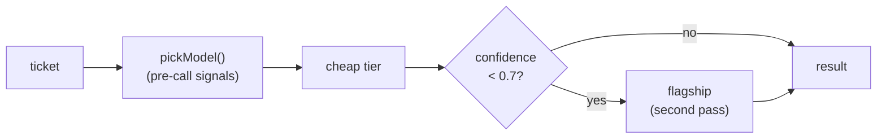

# Lab 7 — Choosing a model

**Time:** 45 minutes · **Prerequisites:** Lab 0, Lab 2, Lab 6

## Why this matters

Everything you have built so far runs on `claude-opus-5`, because
`src/config.ts` says so and nobody questioned it. That is the most expensive
model in the lineup, doing a bounded classification task, 4,100 times a week.
Stated that way it sounds obviously wrong, and every cost-optimization article
you have ever read is about to tell you to move down a tier.

This lab is going to talk you out of that — not on principle, but on
measurement, and not in the direction you expect.

In April 2026 a team at a company much like Northwind moved their classifier
from a flagship model to a cheap one. Accuracy dropped from 94% to 89%, which
they accepted: five points for an 80% cost cut looked like a good trade on the
slide. What the slide did not say was *which* five points. The cases the cheap
model lost were disproportionately the ones where two policy rules touched —
and "two rules touch" is a fair description of every case that matters. The
routine ones were routine for both models.

They also kept their confidence-threshold escalation in place, and it kept
reporting that everything was fine. It was not. That part is the most useful
thing in this lab, and you will measure it yourself in Step 3.

---

> **See the matrix without running it.** The
> [model matrix playground](https://triage.mlynn.dev/playground/models)
> renders a checked-in run, including the per-case disagreement grid.

## Objectives

By the end you can:

- Run the same gold set across tiers and read a disagreement matrix
- Explain why a pinned judge is a precondition for the comparison, not a detail
- Implement confidence-based escalation and say when it does not work
- Make a model decision from evidence and write down what would change it



---

## Step 1 — run the matrix

```bash
npm run eval:models -- --no-judge
```

Three models, twelve cases, four in flight. About ninety seconds and $0.19.

Read the table top to bottom before you read any single column. The measured
result on this repo, across four runs:

| model | accuracy | p50 | p95 | $/mo @ 4,100/wk | calibration gap |
|---|---|---|---|---|---|
| `claude-opus-5` | 10–12 / 12 | 17.8s | 22.4s | ~$137 | 0.35–0.41 |
| `claude-sonnet-5` | 7–9 / 12 | 15.7s | 18.2s | ~$70–98 | 0.20–0.30 |
| `claude-haiku-4-5` | 6–8 / 12 | 9.1s | 9.7s | ~$67–74 | −0.06 to +0.13 |

The latency columns come from the same run and almost nobody reads them either.
Two things about how they were measured, because a latency number without its
conditions is decoration: models run **sequentially** so one tier's traffic
never queues behind another's, and cases run **four in flight** within a model,
so these include some self-contention and are not single-request figures. They
are also whole-request times through the local route, not time-to-first-token —
`/v1/triage` does not stream, and for a classifier that is the number that
matters.

Note that Haiku is roughly **half** the wall clock of Opus while costing about
half as much and losing three to five cases in twelve. Cost and latency move
together down the tiers; accuracy moves against them.

**Q1.** Priya's budget is $4,000 a month. Every row above fits inside it with
between thirty and sixty times the headroom. What does that do to the argument
for moving down a tier?

## Step 2 — read the disagreement matrix, not the score

The score tells you how many. The matrix tells you which, and which is the
question you can act on.

Two patterns reproduce across runs. `eval-04` — the safety case, a customer
reporting that a child swallowed part of a product — fails on Haiku in three
runs out of four and never fails on Opus. And `eval-10`, delivered-not-received
under clause 3.4, fails on both cheap tiers nearly every time.

Neither is random. Both are cases where the correct answer requires holding two
handbook rules at once and preferring the one that is not the obvious reading.

**Q2.** The cheap tier loses cases where two rules interact, and holds its own
on cases with one clear rule. Given Northwind's actual ticket mix, is that a
5% problem or a much larger one? What would you need to measure to answer that
properly?

## Step 3 — the column nobody reads

Look at the calibration gap again. Opus separates its wrong answers from its
right ones by about 0.38. Haiku separates them by roughly **zero**, and in two
of four runs the gap came out *negative* — it was more confident on the cases
it got wrong than on the ones it got right.

One row makes the point better than the aggregate does. On `eval-04` — the
safety case, a customer reporting that a child swallowed part of a product —
Haiku returns the wrong classification at **0.95 confidence**. Not hedged, not
borderline: the highest score it gave any case in the run, on the case where
being wrong is most expensive.

Now consider what that does to the escalation mechanism you are about to build.
`?escalate=true` re-runs on the flagship when confidence falls below 0.7. That
works exactly to the extent that low confidence predicts a wrong answer.

**Q3.** On a model whose calibration gap is zero, what fraction of wrong
answers does a confidence threshold catch? What does the mechanism actually do
to your bill in that case?

```quiz
[
  {
    "question": "A cheap model scores 8/12 with a calibration gap of 0.02. What does the gap tell you?",
    "options": [
      "That the model is badly tuned and needs a better prompt",
      "That its confidence score carries almost no information about correctness",
      "That it is well calibrated — a small gap means consistent scoring"
    ],
    "answer": 1,
    "explain": "A gap near zero means the confidence distribution on wrong answers overlaps the one on right answers. There is no threshold that separates them, so any routing rule built on that score is a coin flip that costs money. Note the trap in option 3: 'consistent' sounds like a virtue, but consistency here means the score says the same thing regardless of whether the answer is right, which is exactly what makes it useless.",
    "note": "This is why the matrix prints the gap next to accuracy rather than in a footnote."
  },
  {
    "question": "Why does `evals/compare-models.ts` pin JUDGE_MODEL instead of judging with the model under test?",
    "options": [
      "Cost — the flagship judge is cheaper than running three judges",
      "Because a moved score would then have two possible causes and you could not tell them apart",
      "Because cheaper models cannot produce structured output"
    ],
    "answer": 1,
    "explain": "If the ruler changes at the same time as the thing being measured, a difference in the result is unattributable: did the tier get worse, or did the grader get more lenient? Pinning the judge makes the comparison single-variable. The run prints both the judge id and a hash of the judge prompt so that two runs graded differently can be detected rather than silently compared. Option 3 is false — all three tiers produce valid structured output; that was checked before this lab was written.",
    "note": "The same discipline applies to the gold set: change the cases or change the model, never both at once."
  }
]
```

## Step 4 — route before the call

Read [`src/lib/route-model.ts`](../../src/lib/route-model.ts). `pickModel`
inspects the message before spending anything: high-stakes language goes to the
flagship, short messages go to the cheap tier, everything else lands in the
middle.

```bash
curl -s 'localhost:8787/v1/triage?tier=auto' -H 'content-type: application/json' \
  -d '{"message":"Where is my package NW-51907?"}' | jq '.meta.routed'
```

```bash
curl -s 'localhost:8787/v1/triage?tier=auto' -H 'content-type: application/json' \
  -d '{"message":"The bottle lining flaked and my kid swallowed a bit of plastic, probably nothing."}' | jq '.meta.routed'
```

The second one routes to the flagship on the word "swallowed" and never asks a
cheap model for an opinion. That is the mechanism that actually protects
`eval-04`, and notice that it works *because it never consults the model whose
confidence you cannot trust*.

**Q4.** `pickModel` reads untrusted customer text to make its decision. Describe
the message that defeats it. Then say why the failure is quiet rather than loud.

## Step 5 — escalate after the call

```bash
curl -s 'localhost:8787/v1/triage?tier=auto&escalate=true' -H 'content-type: application/json' \
  -d '{"message":"i need a refund on order nw48211 and also my email on the account is wrong can you change it to dana.k@example.com"}' | jq '.meta'
```

Two passes. `meta.escalated` names the model that gave up and the confidence
that triggered it; `meta.usage` is the **sum** of both calls, and
`meta.usage_per_pass` itemizes them.

That summing is not bookkeeping fussiness. A two-pass route that reported only
the second pass would under-report its own cost by the price of the first
call — the same trap `/v1/resolve` documents for tool loops, arriving in a
different disguise.

**Q5.** Escalation fires on the cases the cheap model is unsure about. Step 3
established that on Haiku those are not reliably the cases it gets wrong. So
what is `?escalate=true` worth on the cheap tier, and on which tier is it
actually worth something?

## Step 6 — write the decision down

You have five numbers per tier and a matrix. Write three sentences: which model
you would ship for Northwind, what evidence supports it, and what single
observation would change your mind.

**Q6.** Two models score 11/12. Is that the same number?

**Q7.** Your three sentences almost certainly did not mention latency. Nothing
in Northwind's queue is waiting on a human — triage runs over tickets nobody
reads in real time — so say what the latency column is worth *here*. Then
change one thing about the product so that the same column becomes the
deciding number, and say which row you would ship then.

---

## Checkpoint

You should be able to answer, without looking anything up:

- [ ] Why does the disagreement matrix beat the accuracy column?
- [ ] What does a calibration gap near zero do to confidence-based routing?
- [ ] Why must the judge be pinned when the model under test varies?
- [ ] Where does `?tier=auto` read untrusted input, and what follows from that?

---

## Extension

The tone judge in this matrix is a **control**, not a per-tier comparison: it
grades `/v1/draft`, which uses the server's configured model regardless of
`--models`. Make it a real comparison. Thread a model override through the
draft route the way `?model=` was threaded through triage, then judge each
tier's prose with the pinned judge. Predict the result first — writing a
customer-facing paragraph is a very different task from classifying one, and
the tier ordering you measured for classification may not survive.

**Answers:** [../solutions/lab-7.md](../solutions/lab-7.md)
