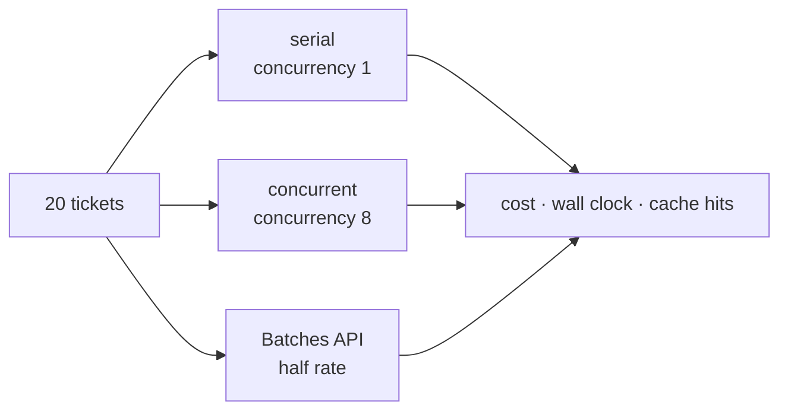

# Lab 9 — Shipping it

**Time:** 60 minutes · **Prerequisites:** Lab 0, Lab 3, Lab 5, Lab 7

## Why this matters

Northwind's queue is 4,100 tickets a week that nobody reads in real time. The
script this repo has been using for it calls a synchronous endpoint in a loop,
one ticket at a time, because that was the endpoint that already existed.

Everyone who reads that sentence reaches the same conclusion: use the Batches
API, it's half price. This lab is going to have you measure that, and the
measurement disagrees.

That is the shape of most production work on these systems. The received
wisdom is usually *directionally* right and quantitatively wrong for your
specific workload, and the difference between a team that knows this and one
that doesn't is a single command they were willing to run.

The rest of the lab is the other things that separate a demo from a service:
knowing your rate limits before they bite, surviving a model that changes
underneath you, and publishing your tools to clients you did not write.

---

```try
{
  "tool": "batch",
  "title": "Compare the three ways before you run them",
  "lead": "Serial, concurrent, and Batches API on the same twenty-ticket workload. Watch how the half-price batch discount can lose to a warm cache.",
  "href": "/playground/batch"
}
```

## Objectives

By the end you can:

- Run the same workload three ways and explain which is cheapest, and why
- Bound concurrency on purpose, and say why a ceiling beats both alternatives
- Read the rate-limit headers that come back on every response
- Say when to pin a model id and when to let it float
- Publish a tool surface over MCP, and tell a tool from a resource



---

## Step 1 — three ways to do the same work

```bash
npm run triage:queue
```

```bash
npm run triage:queue -- --concurrency 8
```

```bash
npm run triage:queue:batch
```

The measured result on this repo:

| mode | wall clock | cost | cache hits |
|---|---|---|---|
| serial | 91s | **$0.1645** | 20/20 |
| concurrent (8) | 60s | $0.1751 | 20/20 |
| Batches API | 163–224s | $0.2018 | **11/20** |

Batch was the slowest *and* the most expensive. On a workload that is the
textbook case for it.

**Q1.** Before reading on: the batch rate is half the synchronous rate. Explain
how the bill came out 23% higher.

## Step 2 — the two discounts compete

The batch discount is **50% off**. A prompt-cache read is **90% off**. They
apply to the same tokens, and this workload sends a ~3,400-token policy
handbook on every request.

The synchronous runs hit that cache 20 times out of 20 — each request follows
close behind the last, and the prefix stays warm. The batch ran 11 out of 20.
Batch requests are executed on the provider's schedule, in parallel, and a
prefix that is not warm when a request lands is one that request pays full rate
for.

Losing a 90% discount to gain a 50% one is a net loss. The arithmetic is not
close.

**Q2.** For what workload does batch clearly win? Describe it in terms of
prefix size and request spacing, not in terms of ticket volume.

**Q3.** Northwind's real backfill is 400,000 archived tickets, run once. Does
your answer to Q1 apply to it? What would you measure before committing?

```quiz
[
  {
    "question": "Your workload sends a large cached prefix on every request. You move it to the Batches API for the 50% discount. What is the risk?",
    "options": [
      "Latency \u2014 batch has a 24-hour SLA",
      "Losing cache hits, which are 90% off, so the bill can go UP",
      "None \u2014 the discounts stack"
    ],
    "answer": 1,
    "explain": "Measured on this repo: serial synchronous cost $0.1645 with 20/20 cache hits; the same twenty tickets through the Batches API cost $0.2018 with 11/20 cache hits. Half rate on tokens you are now paying full price for is more expensive than full rate on tokens discounted 90%. The latency in option 1 is real but usually irrelevant for a batch workload \u2014 that is the whole premise. Option 3 is the assumption that costs money.",
    "note": "The general form: two discounts on the same tokens compete, they do not compose."
  },
  {
    "question": "You raise concurrency from 1 to 8 on a synchronous workload. What happens to cost per ticket?",
    "options": [
      "It falls \u2014 you are using the connection more efficiently",
      "It is unchanged, or slightly worse if requests race the cache write",
      "It rises proportionally with concurrency"
    ],
    "answer": 1,
    "explain": "Parallelism buys wall clock, never price: the same tokens are sent either way. Measured here, cost went slightly UP ($0.1645 to $0.1751) because several of the eight in-flight requests reached the API before the first cache write landed, so they paid to write a prefix that was about to exist. Only batching and caching change the price; concurrency changes the clock.",
    "note": "Wall clock went 91s to 60s \u2014 a 1.5x speedup for 8x the concurrency, because the cache write serialises the start."
  }
]
```

## Step 3 — see your rate limits

```bash
npm run dev
```

```bash
curl -s localhost:8787/v1/triage -H 'content-type: application/json' \
  -d '{"message":"zipper broke on NW-48211"}' > /dev/null && \
  curl -s localhost:8787/v1/limits | jq
```

Every response carries a full accounting of your remaining headroom, and
almost nobody reads it. The usual first encounter with a rate limit is a 429
during a spike, at which point you are answering a capacity question with no
history of your own capacity.

Read [`src/anthropic.ts`](../../src/anthropic.ts) for where the headers get
captured. It is not at the call sites.

**Q4.** The snapshot is recorded by wrapping the client's `fetch` rather than
using `.withResponse()` at each call site. Give two reasons, one of which is
about coverage and one of which is about a bug that `.withResponse()` would
have caused here.

## Step 4 — back off, don't retry

First, the thing you are backing off *from*. Step 1's concurrent run went
through [`src/lib/pool.ts`](../../src/lib/pool.ts) — forty lines, no
dependencies, and worth reading before the adaptive version because most
workloads never need the adaptive version.

Every loop in this repo used to be `for (const x of xs) await f(x)`. That is a
defensible default: it never hits a rate limit and it makes cost accounting
obvious. It is also why `npm run eval` took minutes to do a minute of work.
The tempting fix is `Promise.all(xs.map(f))`, which works on twelve cases and
takes down your rate limit on twelve hundred — you have replaced "too slow"
with "unbounded", **which is the same shape of bug as the uncapped agent loop
from [Lab 3](lab-3-tool-use.md)**. A fixed number of workers pulling from a
shared cursor is the middle option, and it is the one you want by default.

```ts
// src/lib/pool.ts
const width = Math.max(1, Math.min(Math.floor(limit) || 1, items.length));
```

**Q5.** `mapWithConcurrency` returns results in *input* order and throws the
first rejection after in-flight work settles, with no partial-results mode.
Both are deliberate. Defend each in one sentence, given that the caller is an
eval harness.

Now read `AdaptiveGate` in [`src/lib/limits.ts`](../../src/lib/limits.ts). On a
429 it halves in-flight concurrency, waits out `retry-after`, and re-runs.

Note what it does **not** do:

```ts
// src/lib/limits.ts
this.throttleEvents++;
this.width = Math.max(1, Math.floor(this.width / 2));
```

**Q6.** The client in `src/anthropic.ts` already retries 429s three times (`maxRetries: 3`; the SDK default is 2), honouring `retry-after`.
Explain why adding a second retry layer here would be a mistake, and what this
class does instead.

## Step 5 — which model ids can move

`claude-opus-5` is not an alias. From the 4.6 generation on, every Claude model
id is a pinned snapshot, dateless ids included, so the model behind
`claude-opus-5` today is the one behind it next year. Older ids are different:
`claude-haiku-4-5` is an alias for `claude-haiku-4-5-20251001`, and Haiku 4.5
has a retirement date (not sooner than October 15, 2026). This repo's `fast`
tier can therefore move, or be retired, without a commit here.

Read `MODEL_PINS` in [`src/config.ts`](../../src/config.ts), then look at the
`model-upgrade` job in
[`.github/workflows/ci.yml`](../../.github/workflows/ci.yml). It runs the tier
matrix weekly and posts the table to the job summary.

**Q7.** Your eval drops two points on a Tuesday. Nothing was deployed. Walk
through how you would establish whether anything actually changed, including
the model, and what you would have needed to have in place beforehand.

## Step 6 — publish the tools over MCP

```bash
npm run mcp
```

The same three tools, over the Model Context Protocol, for clients you did not
write. Connect Claude Desktop or Claude Code to it and ask a policy question.

Read [`src/mcp/server.ts`](../../src/mcp/server.ts) and notice what is absent:
no descriptions, no schemas, no business logic. It maps over `TOOL_DEFS` from
[`src/tools/definitions.ts`](../../src/tools/definitions.ts), which is the same
array `/v1/resolve` wraps.

The handbook is published as a **resource**, not a tool.

**Q8.** `search_policy` is a tool and the handbook is a resource. State the rule
you would use to decide, and give one example from your own work of something
currently modelled as a tool that should be a resource.

## Step 7 — name what you built

You have written four workflow patterns without calling them that. Label them:

- `/v1/triage` classifying a ticket so it reaches the right queue
- `pickModel` and `?escalate=true` from [Lab 7](lab-7-choosing-a-model.md)
- triage → resolve → draft
- the judge in `evals/lib/judge.ts` critiquing the drafter

Three of them are **routing**, **prompt chaining**, and **evaluator-optimizer**.
The fourth named pattern — **orchestrator-workers**, where a model decomposes a
task and farms out subtasks — appears nowhere in this repo.

**Q9.** Make the case for adding an orchestrator to `/v1/resolve`. Then make
the case against. Which would you ship, and what would have to be true about
Northwind's tickets to change your answer?

---

## Checkpoint

You should be able to answer, without looking anything up:

- [ ] Why did batch cost more than synchronous here?
- [ ] What does concurrency buy, and what does it never buy?
- [ ] Why is `Promise.all` the wrong fix for a slow loop over a metered API?
- [ ] When do you pin a model id?
- [ ] What distinguishes an MCP tool from an MCP resource?

---

## Extension

Wire `AdaptiveGate` into `evals/compare-models.ts` in place of the plain pool,
then force a 429 by running the matrix at `--concurrency 40`. Watch
`throttleEvents` climb and the width halve. Then answer the harder question: the
gate recovers by one after a clean batch, and halves on failure. What happens to
throughput if the true limit sits just below your starting width — and what
would you change?

---

## Where this goes next

This lab is called "shipping it" and it stops one step short of that. You have
batching, rate-limit handling and MCP; you do not have a way for a real ticket
to arrive or a real decision to land anywhere.

[`../next-steps.md`](../next-steps.md) covers the repository that closes that
gap — policy packs in place of Northwind's hardcoded taxonomy, signed webhook
ingest, helpdesk connectors, and the one guardrail argument this course does not
make: what a control should do when it *cannot run*.

```mistake
[
  {
    "id": "promise-all-unbounded",
    "wrong": "const results = await Promise.all(cases.map((c) => runCase(c)));",
    "right": "const results = await mapWithConcurrency(cases, 4, (c) => runCase(c));",
    "symptom": "Fast on twelve cases. On twelve hundred, every request goes out at once and the run dies on 429s.",
    "why": "`Promise.all` has no ceiling. A fixed number of workers is fast enough and never becomes unbounded."
  },
  {
    "id": "rate-limit-tight-retry",
    "wrong": "if (isRateLimit(err)) continue;",
    "right": "if (!isRateLimit(err)) throw err;\nthis.throttleEvents++;\nthis.width = Math.max(1, Math.floor(this.width / 2));\nawait sleep((rateLimitsFromError(err)?.retry_after ?? 2) * 1000);\ncontinue;",
    "symptom": "A 429 turns into a burst of immediate retries at the same concurrency, which draws more 429s. To show this with a mock, the mock needs two things or the script hangs instead of retrying: check the limit before counting the call, so a rejected call never holds a slot (`if (inFlight >= LIMIT) { ... throw } inFlight++;`), and wait a tick before throwing (`await new Promise((r) => setTimeout(r, 1))`). Without the first, rejected calls keep the count over the limit and nothing ever gets through; without the second, the `continue` loop spins on promise callbacks and no timer ever fires.",
    "why": "The SDK has already retried by the time a 429 gets here. What is left to do is send less: narrow the width and wait out `retry-after`."
  },
  {
    "id": "model-alias-pinned",
    "wrong": "  triage: \"claude-haiku-4-5\",",
    "right": "  triage: \"claude-haiku-4-5-20251001\",",
    "symptom": "Nothing is deployed, and the eval still moves one Tuesday, because the alias started pointing somewhere else.",
    "why": "`claude-haiku-4-5` is an alias that can move or be retired. A pin is only a pin if it names the dated snapshot."
  },
  {
    "id": "mcp-tool-description-forked",
    "wrong": "server.registerTool(\"search_policy\", { description: \"Search the policy handbook.\" }, searchPolicy);",
    "right": "for (const def of TOOL_DEFS) {\n  server.registerTool(def.name, { description: def.description, inputSchema: def.inputSchema.shape }, run(def));\n}",
    "symptom": "Works in Claude Desktop. The MCP client now follows a description that says nothing about when to call the tool, while `/v1/resolve` follows the real one.",
    "why": "The description is the tool's behaviour. Two copies drift, so both surfaces should map over the same `TOOL_DEFS` array."
  }
]
```

**Answers:** [../solutions/lab-9.md](../solutions/lab-9.md)
