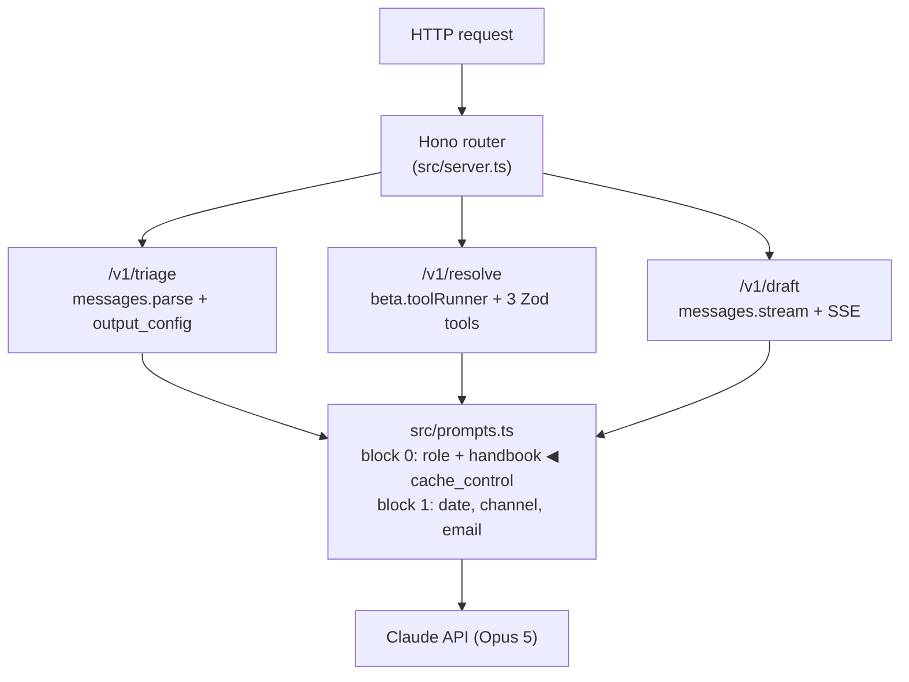
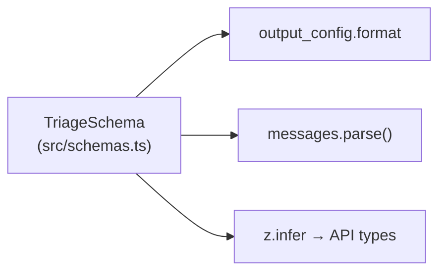
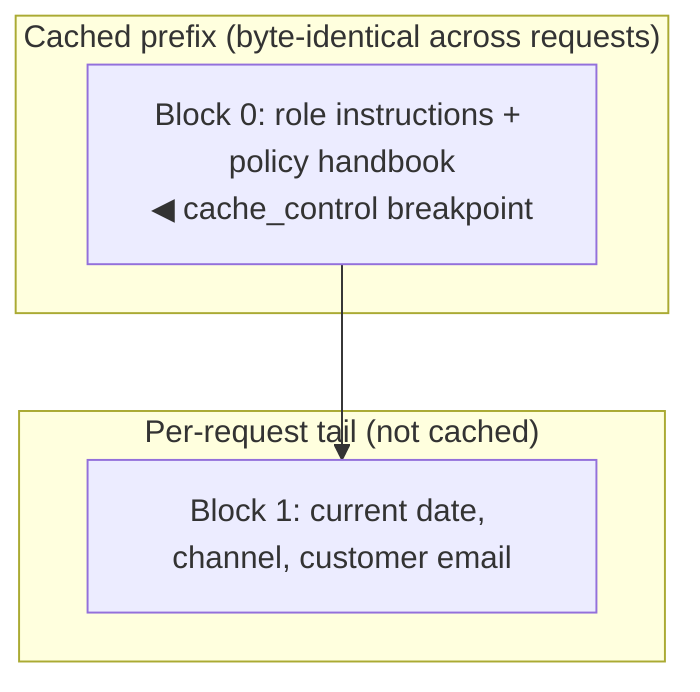
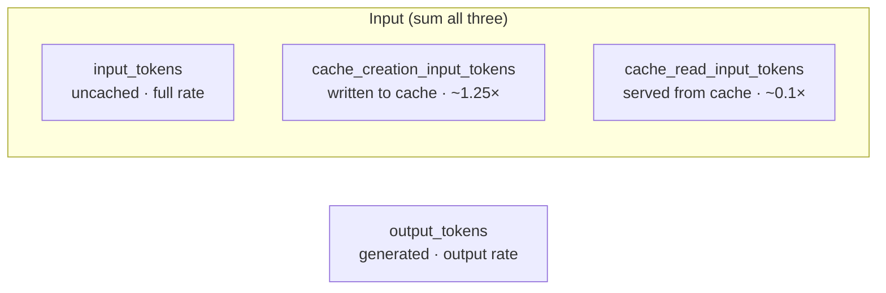
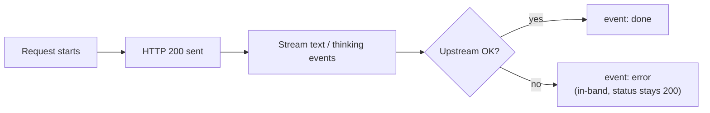

# Architecture and design decisions

This document explains *why* the code looks the way it does. It is the
companion to the inline comments, which explain *what* each piece does.

---

## The shape of the system



Every route shares one prompt assembler, one client, one usage accountant, and
one error mapper. That sharing is deliberate: it means a lab exercise that
changes caching behavior changes it everywhere at once, and the learner sees
the effect on three different call patterns from one edit.

---

## Decision 1 — one Zod schema, three jobs

`src/schemas.ts` defines `TriageSchema` once. It is then used as:



**Why this matters.** The most common way teams get burned by LLM JSON is a
three-layer duplication: a prompt that describes the shape in prose, a
hand-written TypeScript interface, and a parser that repairs malformed output.
Those three drift. Adding a field means editing all three, and forgetting one
produces a bug that only appears on 2% of traffic.

Constrained generation removes the drift by construction. The prompt does not
describe the shape at all — it describes the *semantics* (what "urgent" means,
how to calibrate confidence). The shape is enforced by the API.

**The `.describe()` calls are not documentation.** They are compiled into the
JSON Schema the model receives and are the primary lever for steering a field.
Compare:

```ts
confidence: z.number().min(0).max(1)
```

```ts
confidence: z.number().min(0).max(1).describe(
  "Your calibrated confidence. Use the full range — a genuinely ambiguous " +
  "ticket should score near 0.5, not 0.9."
)
```

The first yields a field that clusters at 0.9 and carries no information. The
second yields a field you can threshold on. Lab 2 has learners measure this.

---

## Decision 2 — the prompt is split for cache stability

Prompt caching is a **prefix match**. The API renders a request as
`tools → system → messages`, and a cache hit requires a byte-identical prefix
up to the breakpoint. Any variation anywhere before the breakpoint invalidates
everything after it.

So `buildSystem()` returns two blocks:



| Block | Contents | Varies? | Cached? |
|---|---|---|---|
| 0 | role instructions + full policy handbook | never | yes — breakpoint here |
| 1 | current date, channel, customer email | every request | no |

The single most common cache bug in production is a timestamp in the system
prompt:

```ts
// Silently destroys the cache on every single request.
system: `Today is ${new Date().toISOString()}\n${POLICY_HANDBOOK}`
```

There is no error. The request succeeds. `cache_read_input_tokens` is just
always zero, and the bill is ~10× what it should be. `src/prompts.ts` is the
only file in this repo permitted to call `new Date()`, and it does so strictly
after the breakpoint.

**Three properties the cache demands, and how the code guarantees them:**

- *Stable text.* Role strings are module-level constants, not template literals
  built per request.
- *Stable order.* Tools are constructed in a fixed order in `createTools()`;
  reordering a tool array is another silent invalidator.
- *Sufficient length.* The prefix must clear ~1024 tokens or the API declines
  to cache with no error. `/v1/estimate` reports
  `prefix_meets_cache_minimum` so this is measurable, not assumed.

Each of the three roles maintains its own cache entry, because the role text is
part of the prefix. That is the correct tradeoff here: three warm entries beat
one entry that thrashes.

---

## Decision 3 — usage is summed, never sampled

`src/lib/usage.ts` exists because `usage` has four fields and the naive reading
of it is wrong:



"Total input" is the sum of the first three. A dashboard that graphs
`input_tokens` alone on a cached workload shows costs collapsing toward zero —
and will not alert you when the cache breaks, because a broken cache moves
tokens *into* the field you're graphing.

The agentic route compounds this. `/v1/resolve` iterates the tool runner rather
than simply awaiting it, specifically so it can capture `usage` on every turn.
Awaiting the runner directly returns the final message, whose `usage` describes
only the final request. On a five-turn loop that under-reports by roughly 5×.

---

## Decision 4 — tool descriptions are prompts

`src/tools/index.ts` treats each tool's `description` as prompt real estate,
because it is the only documentation Claude ever sees about that tool.

Three rules the tools follow:

1. **Say when to call it, not just what it does.** "Call this before stating
   any fact about an order — never rely on what the customer claims" produces
   different behavior than "Looks up an order."
2. **Return small, structured, self-describing results.** `lookup_order`
   returns computed `days_since_delivery` rather than making the model do date
   arithmetic on a raw ISO string. Moving deterministic work out of the model
   is nearly always the right call.
3. **Make failure legible.** `{ found: false, order_id }` teaches the model
   what happened and what to do next. A thrown exception or an empty string
   teaches it nothing and invites a hallucinated order.

`run()` must return a string (or content blocks) — returning a bare object is a
type error. That constraint is a feature: it forces you to make serialization
an explicit decision, since what you serialize *is* what the model reads.

---

## Decision 5 — errors are a chain, and streaming errors are in-band

`src/lib/errors.ts` catches most-specific-first and maps to HTTP with an
explicit `retryable` flag. The distinction that matters to a caller is
retryable (429, 5xx, connection) versus not (400, 401, 404). Collapsing them
into `catch (e) { 500 }` means clients cannot back off correctly and on-call
cannot tell an outage from a malformed request.

One subtlety specific to `/v1/draft`: once streaming starts, the HTTP status is
already 200. An upstream failure mid-stream cannot be expressed as a non-2xx
response, so it is emitted as an in-band `error` event.



**Any client consuming
this route must handle an `error` event, not just a non-2xx status.** This is
the single most commonly missed piece of streaming integration.

Note also that `AuthenticationError` maps to **500**, not 401. The caller's
credentials are not the problem — ours are. Forwarding upstream auth failures
as 401 tells the client to fix a key they don't have.

---

## Decision 6 — effort is per-route and lives in one file

`config.ts` sets `effort` to `low` for triage, `high` for resolve, `medium` for
draft. On this model family `effort` replaces the removed `budget_tokens` and
controls thinking depth and total token spend.

Triage is a bounded classification on the hot path — it does not need deep
reasoning and it runs on every inbound message. Resolve chains multiple lookups
against policy and is where a wrong answer costs real money. Putting these in
one constant makes "what does quality cost here?" a one-line diff, which is
exactly the experiment Lab 5 asks learners to run.

One wrinkle that only appears once you tier models: **`effort` is not universal.**
Haiku 4.5 rejects `output_config.effort` with a 400. `buildTriageRequest`
consults `supportsEffort` in the catalog and drops the field rather than making
every caller remember, and `outputConfigFor` returns whether it applied so a
comparison can say so out loud. A matrix that silently omitted this would be
comparing low-effort Opus against no-effort Haiku while implying they were like
for like — see [Lab 7](../curriculum/labs/lab-7-choosing-a-model.md).

---

## Decision 7 — the two discounts compete, and we measured it

The Batches API bills at half rate, which makes it the obvious tool for
Northwind's weekly queue. Measured on the twenty-ticket sample, it is the most
expensive of the three ways to run that workload:

| mode | wall clock | cost | cache hits |
|---|---|---|---|
| serial | 91s | **$0.1645** | 20/20 |
| concurrent (8) | 60s | $0.1751 | 20/20 |
| Batches API | 163–224s | $0.2018 | **11/20** |

A cache read costs 0.1× the input rate; the batch discount is 0.5×. On a
request dominated by a ~3,400-token cached handbook, losing the first to gain
the second is a net loss, and it is not close. Synchronous requests arrive in
sequence so the prefix stays warm; a batch is fanned out on the provider's
schedule and a warm prefix becomes a matter of luck.

Two things follow, and the second is the one worth keeping:

**`summarizeUsage` takes `{ batch: true }`** so the discount is applied in the
cost math rather than asserted in a comment, and
`scripts/triage-queue-batch.ts` records `cache_hit` per ticket so the
comparison rests on evidence.

**Stacked optimizations can compete rather than compose.** Anywhere you have
two discounts on the same tokens, check whether the second destroys the
precondition of the first. This one is easy to miss because both are real,
both are documented, and each is correct in isolation.

The scale caveat is stated in [Lab 9](../curriculum/labs/lab-9-shipping-it.md)
Q3: at 400,000 tickets the prefix stays hot for hours and the misses seen here
are largely a small-N startup effect. Run a pilot and read the hit rate before
extrapolating a per-unit cost.

---

## Decision 8 — storage is a consequence of escalation, not of submission

The storefront writes a ticket to the queue only when `requires_human` is true.
Everything else is classified and discarded, exactly as before.

That is a deliberate inversion of the usual default. Once you have a database,
storing every submission is the path of least resistance and it is nearly
always wrong: a public demo that accumulates the public's support messages
because it now has somewhere to put them has acquired a liability that grows on
its own, in exchange for data nobody asked for.

Three properties follow, and each is enforced rather than documented:

- **The stored text is redacted**, by the same `redactPII` used at the model
  boundary. Once you persist, "the model was polite about the card number"
  stops being relevant and the only question is what is in the database.
- **Documents expire after 30 days**, via a TTL index in `ensureIndexes()`. The
  only version of a retention policy that survives contact with a busy team is
  one the database applies without being asked.
- **A storage failure degrades the queue, not the answer.** The `persist` stage
  reports `failed` and the pipeline continues to its result. The customer's
  classification does not depend on our operations tooling working.

The stage also demonstrates the one-generator-two-consumers design paying off:
it was added in one place and both the SSE route and the JSON route picked it
up without either being edited. (The JSON route did need one line, because it
selects fields explicitly rather than spreading the event — a cost of that
shape, paid knowingly.)

---

## Decision 9 — cost is model-keyed, and an unknown model throws

`config.ts` holds `MODEL_CATALOG`, keyed by model id. `pricingFor(model)`
resolves a row; `summarizeUsage(usage, model)` is the one function every cost
number in the repo flows through.

Two choices here are worth defending.

**Cost math takes the model as an argument, not from a module constant.** The
earlier version read a single flat `PRICING` object, which meant every reported
figure silently assumed Opus rates — including in the storefront, which had its
own hardcoded copy of the same numbers. Setting `TRIAGE_MODEL` changed which
model answered and changed nothing about what the invoice line said. Passing
`response.model` (rather than the config constant) also means the figure stays
correct when an alias resolves to something else.

**An unknown model id throws rather than defaulting.** A cost table that
guesses is worse than one that crashes, because you discover the guess at the
invoice instead of at the call site. Adding a model is one row.

The catalog carries capability flags alongside the rates, because tiering is
not a name swap — see Decision 6 for the `effort` case.

A third choice, added when the tier matrix landed: **a metric with no data
returns null, not zero.** `calibrationOf` averages confidence on failures, and
an earlier version averaged the empty set to 0. A model that scored 12/12 then
reported a calibration gap of 0.88 — its mean pass confidence wearing the
costume of separation it had never demonstrated. The best-looking number in the
table was the one backed by no evidence. Every display site now renders `n/a`.

---

## Decision 10 — two gates, because they answer different questions

`npm test` and `npm run eval:redteam` both touch the trust boundary and neither
substitutes for the other.

The tests are pure functions: `enforceAuthority` on a fixture resolution and a
fixture trace, `wrapUntrusted` on the `inj-02` payload, `redactPII` on a card
number, `verifyCitations` on a forged clause, `summarizeUsage` on four token
counts. No credential, no network, ~100ms, free, and **exact** — a failure is
always a bug, never variance. They run on every fork PR, in the half of CI that
works without secrets.

The evals are statistical. `eval:redteam` asks whether a model can be talked
past those controls, which is a question about a distribution and costs $0.40 a
run. `eval:quick` gates accuracy at 80% and moves by two cases on its own.

The mistake worth naming is treating either as the other. An eval cannot tell
you that `$200.01 > $200` — it can only tell you that on fourteen cases nothing
got through, and Lab 8 is emphatic that a rate is the wrong shape for a breach.
And a unit test cannot tell you the prompt has drifted. Lab 8's central claim
is that a deterministic control beats a well-written instruction *because it
holds by construction*; a construction nobody tests is an instruction with
better syntax.

**The suite is mutation-checked**, which is the part usually skipped. Breaking
the refund ceiling by one cent, dropping the Luhn check, treating a not-found
customer as zero prior refunds, removing the escaping, and reverting
`verifyCitations` to the version that was wrong each has to turn the suite red.
That check earned its keep immediately: one test was passing for the wrong
reason — an alphanumeric tracking number rejected by the length gate, never
reaching the Luhn check it claimed to exercise — and dropping Luhn entirely
left the suite green. A test that passes at the wrong gate is indistinguishable
from one that passes at the right one until something mutates the code.

Writing them also disproved a claim on this repo's own solutions page. Lab 8 Q5
asserted that escaping before redacting makes a card number undetectable; it
does not, because `&lt;` introduces no digits and `<` was never a legal
separator inside the run. The ordering in `record()` is defensive rather than
load-bearing — though a percent-encoding escape *would* make it load-bearing,
since `%3C` ends in a word character and destroys the boundary the pattern
needs. Both are pinned in `src/lib/untrusted.test.ts`, and the answer now says
what is true.

## What this reference deliberately omits

Being explicit about scope is part of being teachable. Not here:

- **Multi-tenancy and real auth.** The storefront persists escalated tickets
  in one collection. The board itself is public and read-only, seeded with the
  course's own fictional escalations, because the board is the teaching
  artifact and does not need real messages; the real submissions and every
  reviewer action sit behind a single shared token
  ([Lab 8](../curriculum/labs/lab-8-trust-boundary.md) and the `/queue`
  reviewer board). There is no user model, no per-reviewer identity, no
  per-org isolation, and no audit log of who changed what. The UI says so on
  the page, which matters more than the mechanism: the failure mode for demo
  security is not that it is weak, it is that someone downstream mistakes it
  for the real thing.
  The four routes in `src/` are single-turn by design, so the labs stay about
  the API rather than about session storage. Lab 10's assistant is the
  exception and is worth being precise about: it holds a multi-turn
  conversation in an anonymous session for seven days, capped in turns and
  spend. What it does *not* use is any of the API's memory machinery — no
  memory tool, no context editing, no compaction. The history is short enough
  to send whole, and a bounded transcript you can read beats a managed one you
  cannot. **Reach for context management when the transcript outgrows the
  window, not before**; at Northwind's conversation lengths that never
  happens, and adopting it here would be the Agent SDK mistake from Lab 10 in
  a second costume.
- **Server-side tools — web search and code execution.** Both are one field on
  the same request, and neither belongs in this domain. Web search answers
  questions about the world; every fact this system needs is in Northwind's own
  systems, reached through three typed tools whose results are auditable and
  whose latency is a database call rather than a fetch. Code execution has no
  candidate use here at all. The general test is the concept map's: reach for a
  capability when the answer depends on data the model cannot have, not because
  the capability exists.
- **The Files API.** The natural pairing with batch — upload a document once,
  reference it by id across many requests, stop re-uploading bytes. This repo
  never needs it, because its one large stable document is the policy handbook
  and the handbook goes in the **cached system prefix**, which is the cheaper
  arrangement for a document that is on every single request. Files earns its
  place when the documents vary per request and are large — a queue of PDF
  receipts, say — and [Lab 9](../curriculum/labs/lab-9-shipping-it.md)'s batch
  measurement is the shape of the experiment you would run to decide.
- **Auth on the service itself.** There is no API key on our own endpoints.
  Anything internet-facing needs one.
- **A durable queue and worker.** Batch jobs are fired from a script that has
  to stay running to poll. Nothing resumes a partially-processed batch after a
  crash, there is no dead-letter path for the `errored` and `expired` results,
  and a backfill of 400,000 tickets would need all of that.
- **Content moderation.** We defend the trust boundary — untrusted text is
  escaped before it is delimited, tool output is sanitized at `record()`, and
  money decisions are re-derived by `enforceAuthority` rather than taken from
  the model's self-report ([Lab 8](../curriculum/labs/lab-8-trust-boundary.md)).
  What we do NOT do is classify inbound text for hate, self-harm, or illegal
  content. A public product needs a moderation pass in front of triage; a
  support queue for outdoor gear is a soft enough target that we left it out,
  and that is a domain judgement rather than a general one.
- **Observability beyond a daily counter.** The storefront aggregates its own
  Claude usage — calls, cache-hit rate, cost, category mix — into one document
  per day and renders it on `/ops`. That is the floor, not observability: there
  is no tracing, no metrics export, no per-tenant attribution, and no
  alerting. `GET /v1/limits` still shows only the last rate-limit snapshot this
  process saw, and nothing aggregates it.

  The API service in `src/` is deliberately **not** instrumented and will not
  be. It runs on learners' laptops, so there is nothing central to measure —
  and adding phone-home to a repo people fork and read would undercut the
  trust-boundary lab it ships with. That is a constraint of the shape of this
  asset rather than a general recommendation.
