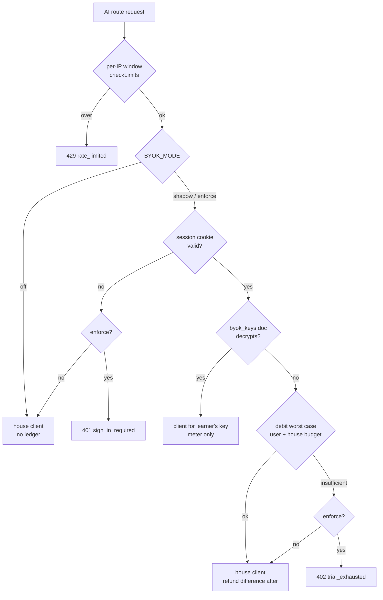
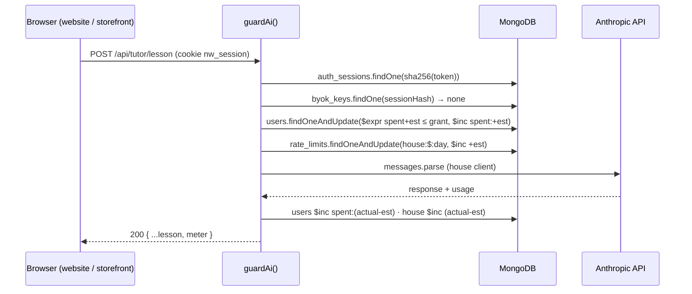

# SPEC: trial credit, BYOK, and metering

**Status:** Implemented (P0–P5; `BYOK_MODE` defaults to `off`) · **Product doc:** [PRD.md](PRD.md) · **Scope:** `storefront/` (the API) and `website/` (the course UI)

`src/` is out of scope. It runs on learners' machines with their own key.

---

## 1. Overview

Every route that calls Claude goes through a single server-side gate. The gate decides **who pays**:



This is what a trial call looks like from start to finish:



## 2. What exists today, and what changes

| Today | Change |
|---|---|
| Four module-level `new Anthropic()` clients: `lib/triage.ts:31`, `lib/live.ts:110`, `lib/tutor.ts:53`, `lib/assistantAgent.ts:40` | Replace them with `lib/anthropicClient.ts`. Each call site takes `client: Anthropic` as a parameter. |
| Cost math copied in four places: `lib/pipeline.ts:281`, `app/api/live/route.ts:122`, `lib/tutor.ts:129`, `lib/assistantAgent.ts:352`. Injection computes none. | One function, `lib/cost.ts` → `costMicros(usage, model)`, priced with `pricingFor()` from `pricing.generated.ts` (Decision 9: price by `response.model`, throw on an unknown model). |
| `checkLimits(ip, scope)` is called directly at `pipeline.ts:131`, `api/injection/route.ts:44`, `api/live/route.ts:60`, `tutorRoute.ts:37`, `api/assistant/message/route.ts:61` | Each of those calls `guardAi()` instead. `guardAi` calls `checkLimits` first. |
| Global `day:` cap counts **requests**. The `queue` scope bumps it too. | The house budget counts **micro-dollars** of trial spend. `queue` no longer touches any paid cap. `SUPPORT_DAILY_CAP` is kept only for `BYOK_MODE=off`. |
| Identity is the anonymous `northwind_assistant` cookie (`lib/assistant.ts`), required only by the assistant | Add a `nw_session` cookie for signed-in users. The anonymous assistant cookie keeps doing its job (`assistant_sessions` progress). The assistant also requires `nw_session` when enforcing. |
| `recordCall` in `lib/telemetry.ts` is called only from the pipeline and the assistant | Called from every surface, with a `funding` counter. It stays aggregate-only. |
| Tutor fetch has no `credentials` (`website/src/components/Tutor/api.ts:21`) | Add `credentials: "include"`. |

We reuse these unchanged:

- the `cors()` origin allowlist;
- the cookie options pattern from `addSessionCookie`;
- the `bump()` atomic upsert idiom from `ratelimit.ts:85`;
- `ensureIndexes()` and the `HAS_MONGO` gating in `lib/mongo.ts`.

## 3. Modules

```
storefront/lib/
  anthropicClient.ts   houseClient(), clientForKey(key)                       (P0, done)
  callLimits.ts        every model id and token ceiling, importable by tests  (P0, done)
  cost.ts              costMicros(), estimateMicros(surface), SURFACE_CEILINGS (P0, done)
  identity.ts          session create/lookup/destroy, users upsert, GitHub OAuth helpers
  secrets.ts           encryptKey(), decryptKey(), redactSecrets()
  ledger.ts            debitTrial(), settleTrial(), debitHouse(), settleHouse()
  funding.ts           guardAi(), Funding type, AiError → Response mapping, meter()
storefront/app/api/
  auth/github/start/route.ts
  auth/github/callback/route.ts
  auth/signout/route.ts
  account/route.ts          GET
  account/key/route.ts      POST, DELETE
```

### 3.1 `anthropicClient.ts`

`houseClient()` is cached on `globalThis`, like the Mongo client. `clientForKey(apiKey)` is built per request and never cached, because a cache would keep a plaintext key alive in a warm instance after its request ends. The live preview's single retry is passed per request (`{ maxRetries: 1 }`), since the client is shared.

Modules added beyond the table in §3: `callLimits.ts` (every model id and token ceiling, importable by tests), `byokConfig.ts` (mode and settings, read per call), `origins.ts` (the one allowlist for CORS, redirects and cookie domains), `lib/accountClient.ts` and `components/AccountMeter.tsx` (storefront UI), `website/src/components/Account/` (course UI), `scripts/grant.mts` and `scripts/byok.integration.mts`.

### 3.2 `cost.ts`

- **`costMicros(usage, model)`** sums the four usage fields at model rates and returns integer micro-dollars. `cost.test.ts` checks it against `src/lib/usage.ts` for every catalogued model.
- **`SURFACE_CEILINGS`** gives each surface a model, **a list of per-request input ceilings**, and `maxOutputTokens`. The assistant has six entries that grow: each request resends the history before it.
- **Two kinds of input text are counted differently:**
  - Our own text (the handbook, the course corpus, tool definitions) at two characters per token. The test reads the real files and fails if they outgrow `OWN_TEXT_TOKENS`.
  - Visitor text at one token per character, because it is adversarial.
- **`estimateMicros(surface)`** prices every input token at the cache-write rate and every request at `max_tokens`.

| Surface | Worst-case reservation |
|---|---|
| `live` | $0.028 |
| `tutor_plan` | $0.072 |
| `classify` | $0.085 |
| `tutor_hint` | $0.20 |
| `tutor_review` | $0.22 |
| `tutor_lesson` (one draft) | $0.31 |
| `assistant_turn` | $0.81 |

### 3.3 `secrets.ts`

```ts
export function seal(plain: string, aad: string): Sealed        // { ct, iv, tag, kv }
export function unseal(sealed: Sealed, aad: string): string | null  // null on any failure; never throws
export function redactSecrets(value: unknown): string           // sk-ant-… in strings, objects and errors
export function looksLikeApiKey(value: string): boolean
export const sha256, randomToken, pkceChallenge, safeEqual
```

- **Master keys.** `BYOK_ENCRYPTION_KEY` is 32 bytes, base64. It is validated when first used, and a malformed value throws with the command that generates one.
  - `kv` is a fingerprint of the master key, not a counter. Rotation means moving the old value to `BYOK_ENCRYPTION_KEY_PREVIOUS`.
  - A sealed key whose fingerprint matches neither master key is deleted by the gate, and the learner enters it again.
- **AAD** is the session hash for API keys, and the literal `"oauth"` for the sign-in state cookie.
- **Log hygiene:** every error log on a gated path goes through `redactSecrets`.

## 4. Identity

### 4.1 Flow

No Auth.js: the flow is three routes and two fetches (`lib/identity.ts`).

1. **`GET /api/auth/github/start?returnTo=<url>`**
   - `safeReturnTo()` compares origins against `ALLOWED_ORIGINS` or the storefront's own origin. Anything else goes to the storefront home page.
   - The state and PKCE verifier go into `nw_oauth`: sealed, httpOnly, path `/api/auth`, 10 minutes. Nothing is stored in the database during the round trip.
   - Redirects to GitHub with no `scope`.
   - When the mode is `off` or no master key is set, it redirects back to `returnTo` instead of to an error.
2. **`GET /api/auth/github/callback`**
   - Opens the state cookie and compares state in constant time.
   - Exchanges the code with its verifier and reads `/user` once. The token is then dropped.
   - `upsertUser()`, then `createSession()`.
   - Redirects to `returnTo?signin=ok`. Every failure redirects to `?signin=failed` (or `cancelled`) rather than showing a JSON error, because the person is mid-navigation. The meter reads the flag, shows a notice, and removes it from the URL.
3. **`POST /api/auth/signout`** checks the Origin, deletes the session and its key, and clears the cookie.

### 4.2 First sign-in and the grant

As specified. The grant is decided in `$setOnInsert`, after a projection-only read that decides whether the `grants:<day>` counter moves.

The integration test pins three properties:
- Signing in again never resets spend.
- An account younger than `TRIAL_MIN_ACCOUNT_AGE_DAYS` gets a $0 grant.
- Renaming on GitHub updates `login`.

### 4.3 Cookies

`nw_session` is 32 random bytes, and only its sha256 is stored. It is httpOnly and `SameSite=Lax`. It is `secure` when the request is HTTPS. `domain` is `.mlynn.dev` when the host is under `mlynn.dev`, and host-only elsewhere, so previews and localhost still work (`cookieDomainFor`).

## 5. Data model

As in the table above. `usage_daily` gains `surface.<name>.{calls,cost_micros}` and `funding.{house,trial,byok}.{calls,cost_micros}`. The top-level `calls` and `cost_micros` still count only tickets and assistant runs, so `/ops` means what it always meant.

## 6. The gate: `funding.ts`

```ts
export type Funding = { surface: Surface; client: Anthropic; settled?: boolean } & (
  | { kind: "house" }                                                     // mode off, no Mongo, or shadow + anonymous
  | { kind: "trial"; userId: string; reserved: number; houseDay: string | null }
  | { kind: "byok"; userId: string; sessionHash: string }
);

export async function guardAi(request: Request, scope: LimitScope, surface: Surface): Promise<Funding>; // throws AiGateError
export async function settle(funding: Funding, spentMicros: number): Promise<Meter | null>;          // idempotent, never throws
export async function keyError(funding: Funding, error: unknown): Promise<AiGateError | null>;
export function gateBody(error: AiGateError); export function gateResponse(request: Request, error: AiGateError): Response;
export async function accountFor(request: Request): Promise<Account>;
```

### 6.1 How `guardAi` decides

1. **Mode `off`, or no database:** today's behaviour. `checkLimits(ip, scope)`, including the request-count daily cap, then `house`.
2. **Otherwise, look up the session**, then run `checkLimits`:
   - Signed-in visitors get the per-IP window × `SIGNED_IN_IP_MULTIPLIER`.
   - The request-count daily cap applies only in `shadow`. Under `enforce` the dollar budget replaces it.
3. **No session:** `sign_in_required` (401) under `enforce`; `house` under `shadow`.
4. **A sealed key that unseals:** `byok`. One that does not unseal is deleted, and the call falls through to the trial.
5. **Reserve the trial credit:**
   - Under `enforce`, `reserveTrial` puts the condition in the filter (`$expr: spent + est ≤ grant`). If nothing matches, the answer is `trial_exhausted` (402), with the meter.
   - Under `shadow`, `forceReserveTrial` reserves unconditionally.
6. **Reserve the house budget:** `reserveHouse(est)`.
   - **MongoDB refuses `$expr` in an upsert filter** (found by the integration test). So the filter is a plain range, `{ _id: "house:$:<day>", spentMicros: { $lte: budget − est } }`, with `upsert: true`. A full document fails the match, the insert collides on `_id`, and error 11000 means over budget.
   - It returns the day's `_id`, so a call that crosses UTC midnight is refunded against the day it was charged to.
   - When over budget under `enforce`, the trial reservation is refunded and the answer is `house_budget` (503, `Retry-After` until midnight UTC).
7. **Any database error** is `store_error` (503) in production and `house` in development.

### 6.2 Settling

`settle(funding, spentMicros)`:
- **Trial:** adjusts the user and the house day by `spent − reserved`. A call that never reached billing passes 0, which refunds the whole reservation.
- **BYOK:** adds to `sessionSpentMicros` and `byokSpentMicros`, and extends the key's TTL.
- **Always:** records `funding.<kind>`, and returns the meter built from the updated documents.

The `settled` flag makes it safe to call from both a success path and a `finally`.

**Retries reserve their own credit.** A Tutor lesson may draft twice when the first draft loses a planted mistake. The gate reserves one draft; before a second, `reserveMore(funding)` makes the same conditional reservation against the learner's credit and the house budget. If it fails, the retry is skipped and the lesson is served from the first draft, rather than refusing a lesson to anyone who could not afford two. Each house reservation remembers its UTC day, and settling refunds each on the day it was taken. How each surface reports its spend:

| Surface | How it reports spend |
|---|---|
| Tutor | Each function calls `onSpend(micros)` as soon as a response arrives, before validation can throw. `tutorPost` settles with the total. |
| Support pipeline | Settles right after the model returns, before parsing or persisting. |
| Injection | Settles right after the model returns. |
| Live preview | Settles with the usage from the last `message_start`/`message_delta`, so a cancelled preview still pays for what it generated. |
| Assistant | `runAssistant` reports the whole run's summed usage through `onSpend`. The route settles before `done`, and again (a no-op) in `finally` for the crash path. |

### 6.2a A learner's own limit

A learner may set a dollar limit on a stored key (`byok_keys.limitMicros`, null for none). It is counted over `sessionSpentMicros`, so it covers everything spent while the key is stored and starts again with a new key.

- **Enforced the same way as the trial.** In the BYOK branch, `reserveKey(sessionHash, est)` reserves the call's worst case with the condition in the filter: no limit, or `sessionSpentMicros + est ≤ limitMicros`. If nothing matches and the key still exists, the gate refuses with `key_limit` (402) and the meter. `settle` turns the reservation into the real cost; `reserveMore` reserves a lesson retry against the same limit.
- **Set when adding a key** (`POST /api/account/key` with `limitUsd`, $0.10–$1,000 or null) or **changed later** (`PATCH /api/account/key` with `limitUsd`). A limit below what has already been spent is allowed and simply stops further calls.
- **Meter:** `key.limitUsd`. The key form pre-fills $5; the BYOK panel shows spend against the limit with a bar, and a `key_limit` refusal opens the limit editor.
- **Honest scope:** the limit is enforced by this site's code. It bounds this site's own spending, not an attacker who controls the site; the Console organization limit remains the backstop, and `/credit` says so.

### 6.3 Errors from a learner's key

`keyError()` matches on the shape of the error (a numeric `status`), not `instanceof APIError`. Two copies of the SDK in a bundle would make `instanceof` fail silently.

| Upstream | Code | Action |
|---|---|---|
| 401 | `key_invalid` (402) | Delete the key |
| 403, 429, or 400 mentioning credit, billing or balance | `key_quota` (402) | Keep the key; pass on Anthropic's message, redacted |
| Anything else, and any error on the owner's key | — | The route's existing handling |

A 403 does not delete the key: it usually means the organization lacks access to a model, and the key is still valid. **No branch falls back to the owner's key**, and the integration test asserts this.

### 6.4 Streaming routes

- **`/api/live` and `/api/assistant/message`** call `guardAi` before opening the stream, so a refusal is a real HTTP status.
- **The support pipeline** reports a refusal in-band. The narrated `ratelimit` stage fails with the gate's code and status, just as rate limits always did there. The JSON route turns that into the HTTP status.
- **SSE routes** emit a `meter` event before `done`. For `/api/live` it is `event: meter`; the assistant and pipeline use a `data:` frame with `type: "meter"`.

## 7. HTTP API

### 7.1 New endpoints

| Method | Path | Success | Errors |
|---|---|---|---|
| GET | `/api/auth/github/start?returnTo=` | 302 → GitHub | — (off → 302 back) |
| GET | `/api/auth/github/callback` | 302 → `returnTo?signin=ok`, sets `nw_session` | 302 → `returnTo?signin=failed\|cancelled` |
| POST | `/api/auth/signout` | 204, clears cookie | 403 `bad_origin` |
| GET | `/api/account` | 200 `Account` (anonymous is valid) | 503 `store_error` |
| POST | `/api/account/key` `{ apiKey, limitUsd? }` | 200 `Account` | 403 `bad_origin`, 503 `unconfigured`, 401 `sign_in_required`, 429 `rate_limited`, 400 `key_malformed`, 402 `key_invalid`, 502 (Anthropic unreachable), 503 `store_error` |
| PATCH | `/api/account/key` `{ limitUsd }` | 200 `Account` | 400 `limit_invalid`, 404 `no_key`, plus the POST preamble errors |
| DELETE | `/api/account/key` | 200 `Account` | as above |

Verification uses `models.list({ limit: 1 })` with no retries and an 8-second timeout. The response is the account; the key is never echoed.

### 7.2 Types

```ts
interface Meter { mode: "trial" | "exhausted" | "byok"; trial: { grantUsd; spentUsd; remainingUsd } | null; key: { last4; sessionSpentUsd; expiresAt } | null }
interface Account extends Meter { mode: "off" | "anon" | Meter["mode"]; enforced: boolean; signedIn: boolean; login: string | null;
                                  estimates: Record<Surface, number>; signInPath: string }
```

`exhausted` means the remaining credit is below the cheapest surface's estimate. A learner with $0.04 left is still `trial`: they can preview, and the meter says that is all.

### 7.3 Refusal body

`{ error, detail, retryAfterSec?, signInPath?, meter? }`.

| Code | Status |
|---|---|
| `sign_in_required` | 401 |
| `trial_exhausted`, `key_invalid`, `key_quota` | 402 |
| `house_budget`, `store_error`, `unconfigured` | 503 |
| `rate_limited` | 429 |

JSON AI responses gain `meter` on success and on failure after spending.

## 8. UI

**Built differently from the draft: an event bus, not wrapped buttons.** The five storefront call sites and the course's two sit in unrelated trees. A provider or an `AiGate` wrapper around every button would touch every component in order to deliver one number. Instead:

- **Two window events.** `accountClient.ts` in each app exposes `publishMeter`, `publishGate` and `reportAi(body)`. Each call site adds one line: hand the response body or SSE event to `reportAi`.
  - A `meter` updates the pill.
  - A refusal code opens the panel with the server's explanation.
  - The live preview passes `{ open: false }`, so a debounced request never pops a panel.
- **`AccountMeter`**, the same component in both apps (Tailwind in the storefront, a CSS module on the course site):
  - It is a pill in the bottom-left corner, clear of Ask Northwind, and renders nothing when the mode is `off`.
  - Pill states: anonymous "Try the AI free · Sign in"; trial "$1.38 credit" in green, amber or red; exhausted "Credit used · Add a key"; BYOK "Your key ••••abcd" in blue.
  - The panel shows the bar and "enough for at least N lessons" from the worst-case estimates. It opens the key form after a credit or key refusal.
  - The key field is a password input and is cleared from state before the request is sent.
  - Also in the panel: remove key, and sign out.
- **Warnings** appear once per threshold (50/80/95%) per GitHub login, remembered in `localStorage` inside try/catch.
- **The course site** mounts the meter in `theme/Root.tsx`. `Tutor/api.ts` and `AssistantDock` send credentials and call `reportAi`/`publishMeter`.
- **The privacy and cookie pages** describe GitHub sign-in, the encrypted key, the `nw_session`/`nw_oauth` cookies and the new retention periods.

## 9. Configuration

Documented in `storefront/.env.example`. The table above stands, with two corrections:
- `BYOK_MODE` is also forced `off` when `GITHUB_CLIENT_SECRET` is unset.
- **Anthropic has no per-workspace spend cap** (`docs/facilitator/keys.md`). The platform backstop is an organization-level spend limit in the Console.

## 10. Security checklist

- [x] The key is accepted only in a POST body, and never returned. `last4` is the only derivative (integration test checks the account view).
- [x] Plaintext is never cached. The client is built per request.
- [x] `redactSecrets` wraps error logs on gated paths. The E2E server log had zero `sk-ant-` matches.
- [x] AES-256-GCM with a random 12-byte IV and the session hash as AAD. Tests cover a wrong AAD, a flipped ciphertext byte, a flipped tag byte, an unknown master key and rotation.
- [x] Session tokens are stored hashed, in httpOnly, `SameSite=Lax` cookies.
- [x] Every state-changing route checks Origin: sign-out and key POST/DELETE. CORS preflight still covers the JSON AI routes.
- [x] `returnTo` is checked by origin, with tests for `//evil.com`, `https://triage.mlynn.dev.evil.com`, userinfo tricks, `javascript:` and scheme downgrades.
- [x] OAuth state is compared in constant time, PKCE S256 is used (tested against the RFC 7636 vector), and the GitHub token is dropped after one read.
- [x] No owner's-key fallback on any BYOK error path (integration test).
- [ ] **Owner action:** set an organization-level spend limit in the Anthropic Console before switching to `enforce`.

## 11. Docs and ops

Done:
- `docs/architecture.md` has Decision 12 (with a snippet the snippet checker verifies against `ledger.ts`), the TTL collection list and the amended "omits" section.
- `docs/facilitator/keys.md` has "Hosted demos in a workshop".
- `storefront/scripts/grant.mts` raises a cohort's grant with `$max`, so running it twice is a no-op.
- The course pages explain sign-in through the meter itself, and the privacy and cookie pages are updated.

## 12. Rollout

Code for P0–P5 is in place. What remains is operational:

1. **Configure:**
   - Create GitHub OAuth apps for production and for `localhost:3002`.
   - Set `GITHUB_CLIENT_ID`, `GITHUB_CLIENT_SECRET` and `BYOK_ENCRYPTION_KEY` in Vercel.
   - Set a Console organization spend limit.
2. **`BYOK_MODE=shadow` for a week.** Read `usage_daily.surface.*` and `funding.*`, and tune `TRIAL_GRANT_USD` and `HOUSE_DAILY_BUDGET_USD`.
3. **`BYOK_MODE=enforce`.**

## 13. Tests

| Kind | File | Run |
|---|---|---|
| Unit | `storefront/lib/cost.test.ts`, `secrets.test.ts`, `origins.test.ts`, `byokConfig.test.ts` | `npm test` at the repo root |
| Integration (real MongoDB) | `storefront/scripts/byok.integration.mts` | `cd storefront && MONGODB_URI=mongodb://127.0.0.1:27199 NODE_PATH=scripts/test-stubs npx tsx --test scripts/byok.integration.mts` |

The integration file refuses to run against Atlas and drops its own database. It covers:
- 20 concurrent reservations against credit for 5, where exactly 5 succeed;
- the house budget under concurrency;
- grants;
- enforce and shadow;
- reserve and refund, refunds on failure, and an exhausted learner still using a cheaper surface;
- refusal by the house budget, with the reservation returned;
- BYOK use, and a key sealed to one session not working from another;
- a 401 deleting the key with no fallback, and quota classification;
- sign-out deleting the session and key;
- TTL indexes on every new collection.

**End to end over HTTP**, run against `next start` in `enforce` with a local MongoDB:

| Request | Result |
|---|---|
| Anonymous hint | 401 |
| Sign-in start | Redirects with PKCE and a sealed state cookie; a hostile `returnTo` is dropped |
| Forged callback | Redirects with `?signin=failed` |
| Trial call that fails upstream | Reservation refunded to $0.00 |
| Key with a bad shape | 400 |
| Key from a foreign origin | 403 |
| Key Anthropic rejects | 402 |
| Exhausted learner | 402 with meter |
| Sign-out | Clears the session |

In a browser, the anonymous, trial and exhausted states render, and a refused classification opens the key form.

**Still needs a real GitHub app and a real key** (not possible from a test harness):
- the GitHub round trip;
- a successful call on a learner's key;
- revoking that key mid-session.
