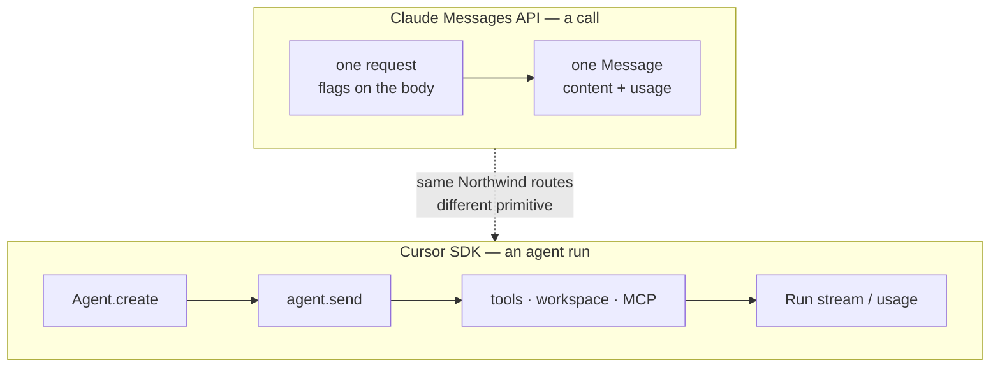

# Model APIs and agent runtimes: different primitives, different jobs

This course builds Northwind's triage service on the Claude API. A sibling
repository builds **the same four routes, for the same fictional company, with
Cursor's Agent SDK**:
[mrlynn/cursor-triage-api](https://github.com/mrlynn/cursor-triage-api).

The comparison is not a vendor scorecard. It is an architecture note about a
useful distinction: a Messages API is a request/response primitive, while an
agent runtime is designed to run work across tools, a workspace, MCP servers,
and developer workflows. Read [why this course exists](https://triage.mlynn.dev/why-this-course-exists)
for the author’s context and independence disclosure.

The two repositories hold the HTTP spine, Zod field names, handbook, fake order
system, and `enforceAuthority` re-check constant. That controlled setup makes
the design tradeoffs legible without suggesting the products are interchangeable.

**The shape of the difference, in one line.** The Messages API is a *call*.
Cursor's SDK is an *agent run*. Almost everything below follows from that.



---

## Where the Cursor column comes from

Read for the sibling repo, and cited there rather than remembered:

- [Cursor APIs overview](https://cursor.com/docs/api)
- [Cursor TypeScript SDK](https://cursor.com/docs/sdk/typescript)
- [Cloud Agents API endpoints](https://cursor.com/docs/cloud-agent/api/endpoints)

This matters more than it looks. A capability matrix assembled from memory of
marketing pages is worth nothing, and it is the default failure mode of every
"X vs Y" post you have ever read. Where the Cursor docs publish no number — the
Cloud Agents rate limit is the live example — this page says so instead of
supplying one.

---

## The capability matrix

| Capability | This course (Claude) | The Cursor twin | Maps? |
|---|---|---|---|
| **Unit of work** | `POST /v1/messages`, with flags on the request | `Agent` + `Run` — `Agent.create`, `agent.send` | Same product routes, different primitive |
| **Structured outputs** | `output_config.format` + `messages.parse()` | Prompt for JSON, then Zod in your own process | **Does not map.** The teaching point, not a hidden bug |
| **Tool use** | Messages `tools` / `toolRunner`, wherever Messages works | `local.customTools`, local only. On cloud it is MCP servers, not this callback | **Partial** |
| **Streaming** | `messages.stream()` token deltas | `run.stream()` `SDKMessage`, or `onDelta` | **Maps** as "stream the run," not as Messages events |
| **Prompt cache** | You place `cache_control` breakpoints; per-model minimum (512–4096) | `cacheReadTokens` / `cacheWriteTokens` are reported; you set nothing, and no TTL knob is documented | **Observability maps. Control does not** |
| **Token count before a call** | `messages.countTokens()` — free, no inference | Not documented. Their `/v1/estimate` refuses to invent one | **Does not map** |
| **Usage after a call** | `usage` on the Message | `run.usage`; dollars via `agent.getUsage()` (`rawCostCents`, `chargedCents`) | **Maps**, different fields and a different billing API |
| **Batch** | Batches API, half rate | No batch-inference API in the docs read. Cloud agents are a different product | **Does not map** |
| **MCP** | [Lab 10](../curriculum/labs/lab-10-ask-northwind.md) exposes an MCP server *of* these tools | Agents *consume* MCP as a first-class input | **Maps, in the other direction** |
| **Rate limits** | Anthropic rate-limit headers, read off the last call | `Cursor.me()` plus published text. Cloud Agents publishes no number | **Partial** |
| **Auth** | `ANTHROPIC_API_KEY` | `CURSOR_API_KEY`, user or service-account | **Maps.** One env var each |
| **Typed errors** | `AuthenticationError`, `RateLimitError`, … | The same, plus `AgentBusyError` — a state Messages has no equivalent for | **Maps** |
| **Models** | A small catalog and list prices, in `src/config.ts` | `Cursor.models.list()`, live | **Do not copy one catalog onto the other** |

---

## What does not map, in four words each

Constrained decoding. Pre-call token count. A cache breakpoint you place. A
half-price batch of classifications.

Each of those is a lab in this course —
[2](../curriculum/labs/lab-2-structured-outputs.md),
[5](../curriculum/labs/lab-5-prompt-caching.md),
[7](../curriculum/labs/lab-7-choosing-a-model.md) — and each is a lab that
would have to be rewritten from scratch on the other API rather than
translated. That is the honest measure of how far apart two APIs are: not the
feature checklist, but how much of the curriculum survives the port.

---

## Choosing the right primitive

**Pick the Messages API** when the job is classify, draft, or run a cheap tool
loop against your own backend; when you need a JSON schema the API enforces;
when you need `count_tokens` for admission control; or when a stable handbook
wants a cache breakpoint on it. That is nearly all of Northwind triage, which
is why this course is built the way it is.

**Pick the Cursor Agent SDK** when the job is *run the agent*: a workspace, repo
edits, a shell, MCP servers, cloud VMs, or opening a PR. These are developer
workflow and workspace tasks the Messages API is not designed to operate.
Support triage can also sit on that primitive—the sibling repository is a
working reference—but its response contract and cost controls are shaped
differently.

**This half of the page is the part to trust the rest by.** A comparison
published by one of the two vendors that never concedes anything is marketing
with a table in it. A Messages call has no workspace, no shell and no
filesystem: the work Cursor's primitive exists for is work this course's
runtime cannot do at all. Where that is the job, the choice is not close.

---

## The measured part

Everything above is an argument from documentation. Arguments from
documentation are how comparisons go wrong, so both repos ship a command that
produces numbers instead.

```bash
npm run eval:compare                       # here
npm run eval:compare                       # in the Cursor twin
npm run eval:compare:report -- <a> <b>     # merge, by case id
```

Three cases run on both sides — `eval-01`, `eval-04` and `eval-05`, byte
identical in both datasets. Each repo writes a self-describing **envelope**
from its own process, with its own SDK and its own key. The reporter stitches
the envelopes afterwards and makes no network calls at all.

That separation is the design. One process holding both SDKs would share an
event loop, a DNS cache and a machine, and the latency column — the headline
number of the whole comparison — would quietly become a measurement of
contention between two clients.

### What gets measured

**Schema adherence** is the sharpest of them. `output_config.format` makes a
malformed response near-impossible here by construction; the Cursor route
prompts for the contract and validates afterwards, so a reply that never
becomes a `TriageResult` is a 502 and therefore a *rate you can count*. The
envelope tracks `unparseable` separately from `fail` for exactly this reason. A
metric that is structurally 1.0 on one side and measured on the other is worth
more than any row in the matrix above.

Then: **latency** p50/p95, **accuracy** on the shared cases, **tokens per
decision**, **cost** projected onto Northwind's real load, and the
**calibration gap** from [Lab 6](../curriculum/labs/lab-6-evals.md).

### What the report refuses to do

Three refusals, each enforced in code. Each would make the output shorter and
each would make it a lie.

1. **It will not merge envelopes across versions.** Two repos drift. A table
   whose columns mean different things on different rows is worse than no
   table, because it still looks right.
2. **It will not difference costs across bases.** This side estimates from a
   checked-in price table; the Cursor side reports settled `chargedCents`.
   Those are not the same kind of number, and subtracting one from the other
   produces a slide nobody should trust. They print as separate rows, each
   under its own basis.
3. **It will not quote accuracy without the sample size.** Three cases cannot
   support a percentage. The disagreement matrix is the output that answers
   "would I ship this."

Every envelope also carries a `not_available` map: capability, mapped to *why*
it is missing. Both sides have entries — this one declares that it cannot price
a call from an invoice and has no workspace at all. A map that came back empty
would mean the comparison had stopped being evidence.

### The numbers

**Not yet run.** A live comparison needs a key on both sides and spends real
money, so this section is deliberately empty rather than filled with an
estimate.

When it is run, the table lands here, generated by
`npm run eval:compare:report -- … --out`, carrying its own provenance row: the
exact command, both SDK versions, the model ids, the repeat count and the
sample size. Nothing on this page will be a number that was typed by hand.

---

## What this page will not claim

No cost bake-off has been run. No Claude list price has been multiplied onto a
Cursor token. No Cloud Agents requests-per-minute figure has been invented,
because none is published.

If you find a number here that you cannot reproduce from a command in one of
the two repositories, it is a bug, and it is a more serious one than a wrong
answer in a lab.
